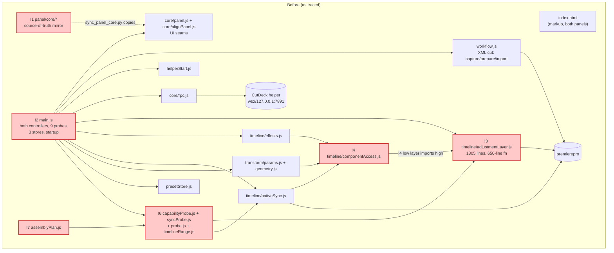
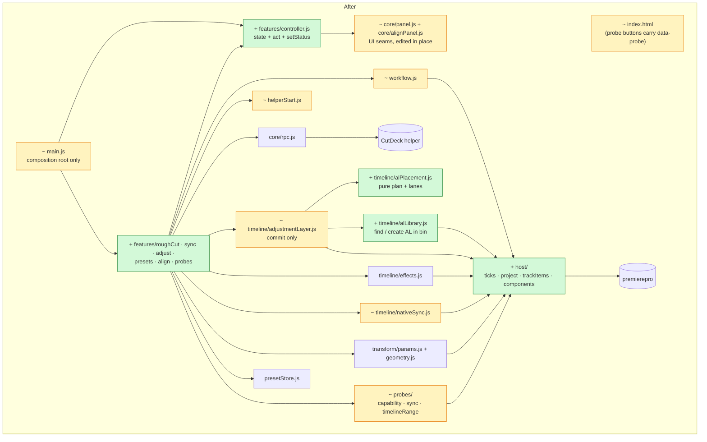

# CutDeck UXP panel — module design & audit

**What the picture shows:** the panel's UI is already cleanly separated (issue #45). The drift now
comes from **below and beside the UI**. `main.js` has become the file every feature lands in, and
the Premiere plumbing (ticks, transactions, bins, track-item reads) is written again in each
feature file. The fix is one **host/** layer that owns the plumbing, one **features/** folder that
splits up the controller, and **guard tests** that fail when a later edit crosses a line.

Traced 2026-09-23 against `master` @ `9850b30`. This is accurate for that date only; it goes stale
as the code moves.

*Evidence labels: **proven** = ran it · **traced** = read the whole chain · **suspected** = neither.*

---

## Verdict

**Messy in places. The UI layer is clean; the domain layer is tangled.**

- **Clean (keep as is):** `core/panel.js` and `core/alignPanel.js` are the only files that touch the
  DOM, with a `render(state)` / `bind(intents)` contract. Four tests hold that rule: DOM-access
  allowlist, id resolution, no hex colours outside the theme, render idempotence. `core/rpc.js`,
  `presetStore.js`, `transform/*` and `timeline/alProject.js` are small, well-bounded and tested.
  All 240 node tests pass (*proven*: `node --test tests/cutdeck_*.test.cjs tests/panel_*.test.cjs`).
- **Tangled:**
  - `main.js` (686 lines, **36 commits since 08-01**, the most-edited file) holds the controllers for
    both panels, 9 probes, preset capture, three localStorage stores and startup.
  - `timeline/adjustmentLayer.js` (1305 lines) holds one **650-line function**
    (`placeAdjustmentLayersOnTimeline`, lines 640–1290). It mixes pure placement math with Premiere
    mutation.
  - The same host plumbing exists in 3–7 copies.

**The one move that pays most:** a `host/` layer that owns ticks, transactions, bins and track
items (moves 3–5). A guard test then stops copy number 8 from appearing. Every later refactor rests
on this.

**The decision most expensive to reverse:** the **layer rule** (below). The code isn't locked in by
it. Once a dozen files follow the rule, though, undoing it means rewriting all of their imports. It
is still a two-way door, so it is recorded here rather than raised as a stop-and-ask.

---

## Before — the module map as it is (problems marked)



`!5` (duplicated plumbing) has no single box. It is spread across `workflow.js`,
`adjustmentLayer.js`, `componentAccess.js`, `effects.js`, `nativeSync.js`, `syncProbe.js` and
`capabilityProbe.js`; see the findings table.

### Evidence (arrows)

| arrow | file:line |
|---|---|
| main → every module | `uxp/cutdeck/main.js:1-17` |
| componentAccess → adjustmentLayer (inverted) | `uxp/cutdeck/timeline/componentAccess.js:18-35` |
| effects → componentAccess | `uxp/cutdeck/timeline/effects.js:44` |
| params → componentAccess | `uxp/cutdeck/transform/params.js:25` |
| nativeSync → componentAccess | `uxp/cutdeck/timeline/nativeSync.js:19` |
| capabilityProbe → adjustmentLayer, alProject, timelineRange | `uxp/cutdeck/capabilityProbe.js:18, 967-968` |
| syncProbe → capabilityProbe, componentAccess, nativeSync | `uxp/cutdeck/syncProbe.js:22-25` |
| assemblyPlan → timelineRange | `uxp/cutdeck/assemblyPlan.js:14` |
| mirror copy (dashed: a build step, not an import) | `scripts/sync_panel_core.py:12` |
| rpc → helper | `uxp/cutdeck/core/rpc.js` (`URL` const, mirror of `panel/core/rpc.js:15`) |

---

## After — the same map with the moves applied



Removed in *after*: `panel/core/` + `scripts/sync_panel_core.py` + `tests/panel_core_sync.test.cjs`
(`!1`). `assemblyPlan.js` and `probe.js` are **not** removed here. They are *suspected* dead and go
to `latent-audit` (see Questions).

### Legend

| Mark | Meaning | Style |
|---|---|---|
| `+` | added | green |
| `~` | changed | amber |
| `!N` | problem N (see findings) | red fill |
| none | unchanged | grey |

---

## Findings

| # | sign | where | what it costs today | move | effort |
|---|---|---|---|---|---|
| !1 | built for "gonna need": a source-of-truth mirror with one consumer | `scripts/sync_panel_core.py:12` (`MIRRORS` has one entry); `panel/core/*` ↔ `uxp/cutdeck/core/*`. CEP was deleted in #41 | Every UI edit touches 2 files plus a sync step. Tests import `panel/core/...` while Premiere runs `uxp/cutdeck/core/...`, so a forgotten sync can pass tests and still ship stale UI | 1 | S |
| !2 | one place doing everything | `main.js` 686 lines: two copies of the controller (`act` :151, `actAlign` :577); 9-branch probe chain :352-447; preset capture hidden inside `handleProbe` :417; 3 localStorage stores :19-20, :61-118 | Every feature edit lands here (36 commits since 08-01). Can't be `require`d off-host, so it has no unit tests; a syntax slip broke the live panel on 2026-09-23 (`cutdeck_syntax.test.cjs` header) | 6, 7, 8 | M |
| !3 | one place doing everything | `timeline/adjustmentLayer.js:640-1290`. One function reads the sequence, resolves the top layer, plans 3 modes, assigns lanes, finds or creates the AL, commits, trims, colours and names | The placement rules (the part that keeps changing, with 5 dated "confirmed 2026-09-2x" fixes) can only be exercised live in Premiere, because the file `require("premierepro")`s at line 1 | 9 | L |
| !4 | arrow points the wrong way | `timeline/componentAccess.js:18-35`. The shared low-level module imports the 1305-line feature module (for `getTrackClipItems`) and has a hand-written fallback copy for when that import fails off-host | Two implementations of "read a track's clips". Which one runs depends on whether `premierepro` loads | 5 | M |
| !5a | same job, many places: **transactions** | `executeTransaction`+`lockedAccess` inlined in `workflow.js:63-69`, `adjustmentLayer.js:40-46, 71-75, 1071-1078, 1089-1141, 1166-1183, 1223-1230, 1240-1248`; owner-shaped copy in `componentAccess.js:127-137` | The #18 rule ("never call it bare") is re-applied by hand 8 times. Copy 9 is where it gets forgotten | 4 | M |
| !5b | same job, many places: **ticks** | `TICKS_PER_SECOND` in `timelineRange.js:26`, `nativeSync.js:21`, `syncProbe.js:27`; converters `adjustmentLayer.js:329` (`toBigIntTicks`), `effects.js:46` (`tickCount`), `nativeSync.js:25` + `syncProbe.js:31` (`big`), `timelineRange.js:41` (`ticks`), `capabilityProbe.js:50` (`readTick`); literal `254016000000` at `adjustmentLayer.js:335, 338, 377, 379` | 6 converters with 6 different edge-case behaviours: `toBigIntTicks` silently returns `0n` on garbage, while `timelineRange.ticks` throws. An off-by-one frame bug has 6 places to hide | 3 | S |
| !5c | same job, many places: **bins** | `workflow.js:42, 55-76` (`getOrCreateCutDeckBin`) and `adjustmentLayer.js:11, 32-53` (`getOrCreateChildBin`). `"CutDeck"` is declared twice | Renaming the bin, or fixing bin creation, has to be done twice | 4 | S |
| !5d | same job, many places: **selection** | `adjustmentLayer.js:417` (`getSelectedTimelineClips`) and `componentAccess.js:63` (`getSelectedTrackItems`) | Transform panel and AL placement can disagree about what is selected | 5 | M |
| !5e | same job, many places: **small helpers / constants** | `baseName` in `nativeSync.js:26` + `syncProbe.js:32`; helper protocol `"cutdeck-xml-2"` in `workflow.js:2` + `helperStart.js:48` + `cutdeck/xml_bridge.py:27` | A protocol bump missed in one place gives a helper that "never answers hello" | 2, 3 | S |
| !6 | no shared way: probes | Probe ids listed in `core/panel.js:358` **and** `:496-515`, dispatched in `main.js:352-447`, implemented in `capabilityProbe.js` (1093 lines) / `syncProbe.js` / `probe.js` | Adding a probe means 4 files and 5 places | 8 | S |
| !7 | half-built / unreachable (*suspected*) | `assemblyPlan.js`: no production `require` (only `README.md` and `tests/cutdeck_assembly.test.cjs`). `probe.js:1` says "TEMPORARY DIAGNOSTIC — delete once the permitted socket URL form is known" | Reads as live code to the next maintainer | → `latent-audit` | — |
| !8 | noise: build output in the source tree | `uxp/cutdeck/package/*.ccx` is untracked and not in `.gitignore`. `cutdeck_syntax.test.cjs` already special-cases `package` | A `git add -A` commits a binary | 10 | S |
| !9 | stale docs | `uxp/cutdeck/README.md` still points at `panel/core/panel.js`, calls native assembly "in progress", and names CEP as a sibling | The first file a maintainer opens sends them to the wrong place | 10 | S |

---

## The module table (target)

The layers, top to bottom. **A module may import only modules in its own layer or a lower one.**

| layer | module | responsibility (one sentence) | owns | must never know |
|---|---|---|---|---|
| **L0 composition** | `main.js` | Creates the controllers, binds each UI seam to its feature intents, registers entrypoints, runs startup. | Wiring order, `entrypoints.setup` | Any Premiere API call, any status text, any feature logic |
| **L1 UI** | `core/panel.js`, `core/alignPanel.js` | Turn a state object into DOM, and DOM events into intent calls. | Every DOM touch, presentational-only local state (menu/modal open) | Premiere, the helper, storage, what an intent does |
| L1 UI | `core/theme.css` | Every visual value, as tokens. | Colours, spacing, type | Behaviour |
| **L2 features** | `features/controller.js` | Hold one panel's state, serialise actions (`act`), set status, call `render`. One instance per panel. | `state`, `busy`, `status` | DOM, Premiere |
| L2 features | `features/roughCut.js` | Cut / Resume / Dismiss / follow a helper job. | `cutdeck.xml.lastJob` (job store) | DOM, AL/FX |
| L2 features | `features/sync.js` | Run native Sync and report the result. | — | DOM, the job store |
| L2 features | `features/adjust.js` | Place an AL (plain or with a preset) and write the result message. | AL status wording, `cutdeck.adj.settings` | DOM, how placement is computed |
| L2 features | `features/presets.js` | Capture / rename / remove / choose folder. | Preset intents | DOM, file layout (that is `presetStore`) |
| L2 features | `features/align.js` | Transform panel: read the selected clip's transform, polling. | `alignState` shape, poll timer | DOM |
| L2 features | `features/probes.js` | A registry `{id → startText, run, format}`, plus copy-status. | The probe list (one list) | DOM, individual probe internals |
| **L3 domain** | `workflow.js` | XML rough cut on the Premiere side: capture marks, export, import the result. | Helper protocol `VERSION` (single owner) | Status text, storage |
| L3 domain | `helperStart.js` | Launch or restart the helper process. | Launcher path rule | Job semantics |
| L3 domain | `core/rpc.js` | One request/reply over the helper socket, with the safe-retry rule. | URL, retry policy | Request meanings |
| L3 domain | `timeline/adjustmentLayer.js` | Commit an AL placement plan to the sequence (overwrite, trim, colour, name). | The commit sequence and its verification | Mode rules (that is `alPlacement`), bin layout (that is `alLibrary`) |
| L3 domain | `timeline/alPlacement.js` **(pure)** | From selected clip spans + mode + frames + playhead → a placement list and lanes. | Top-layer resolve, span/per_clip/transition rules, `assignPlacementLanes` | Premiere (no `require("premierepro")`) |
| L3 domain | `timeline/alLibrary.js` | Find or create the AL that matches the sequence size in CutDeck > ADJ & FX. | `ADJ_BIN_NAME`, candidate pick, import-wrapper tidy | Placement |
| L3 domain | `timeline/alProject.js` + `alSeedData.js` **(pure)** | Build a one-AL `.prproj` of any size. | Seed + patching | Premiere |
| L3 domain | `timeline/effects.js` | Capture and apply effect presets, keyframes included. | Captured preset shape | Storage, AL placement |
| L3 domain | `timeline/nativeSync.js` | Plan and apply multi-cam Sync on a `_Synced` copy. | Sync placement, read-back check | Status wording beyond its report |
| L3 domain | `transform/params.js`, `transform/geometry.js` (pure) | Read Motion params; convert normalized ↔ pixel. | Param indices proven live | Effects |
| L3 domain | `presetStore.js` | Preset persistence: folder files + localStorage cache. | `cutdeck.fx.presets`, file format | Premiere |
| L3 domain | `probes/*` | Read-only (or copy-only) host experiments that return a report and never throw. | Findings format | Production paths (nothing in L3 imports a probe) |
| **L4 host** | `host/ticks.js` | The one tick converter and the one `TICKS_PER_SECOND`, plus the TickTime factory. | Tick parsing and its failure behaviour | Features |
| L4 host | `host/project.js` | Active project and sequence; `runTransaction` (the #18 rule); `getOrCreateBin(path[])`; `CUTDECK_BIN_NAME`. | Every `executeTransaction` / `lockedAccess` call | Features |
| L4 host | `host/trackItems.js` | Read a track's clips (throwing and tolerant variants) and the current selection. | Every `getTrackItems` / `getSelection` call | Features |
| L4 host | `host/components.js` (today `timeline/componentAccess.js`) | Component-chain access and keyframe value unwrap. | `isFixedComponent`, `unwrapKeyframeValue` | Features |

**Why `host/` is a new folder and not "extend componentAccess".** Following "one of each" means
extending the owner that already exists: `componentAccess.js` is the host-plumbing owner, and
`host/components.js` *is* that file, moved. Ticks, transactions and track items don't change for the
same reason as component chains, though, so they get sibling files, not one bigger file. That meets
the complexity bar: host plumbing has 7 callers today (`workflow`, `adjustmentLayer`, `effects`,
`nativeSync`, `params`, `syncProbe`, `capabilityProbe`).

---

## Contracts

**UI seam → controller** (unchanged from #45; restated so it lives in one place)
- `render(state)`: a pure sink and idempotent. `bind(intents)`: listeners are attached once, and
  handlers receive intent data, never DOM events.
- Main panel state: `{ sequence: {name,inSeconds,outSeconds,audioTrackCount}|null, tab: "edit"|"adj",
  cutMode: "protected"|"silence", audioTrack: int|null, settings: {frames,bin,color,clamp},
  customPresets: Preset[], presetFile: {path,error}, job: {id,state}|null, busy: bool,
  status: {text, level: "ready"|"busy"|"error"} }`.
- Align panel state: `{ sequence: {name}|null, transform: {clipName,available,reason,fields}|null,
  busy, status }`.
- Adding a state field means one line in this contract, plus the render function that reads it.

**Controller** (`features/controller.js`)
```js
createController({ render, initialState }) -> {
  state,                       // the one mutable object; features may read and assign fields
  act(fn),                     // no-op while busy; sets busy, runs fn, puts a thrown Error.message in status
  setStatus(text, level),      // render included
}
```

**Feature module**
```js
createXFeature({ ppro, ctl, rpc?, ensureHelper?, store? }) -> { onIntentA(...), onIntentB(...) }
```
Every Premiere-touching intent runs through `ctl.act`. A feature never touches the DOM, never reads
another feature's state fields, and reads or writes only the localStorage key it owns.

**Host adapter functions** take `ppro` / `project` / `seq` and return plain data (ticks as `BigInt`)
or throw.

**Error shape (one convention).** A thrown `Error.message` is **shown to the user verbatim** in the
status line. So it is a full sentence that says what to do ("Open a sequence first."), never a stack
or code. Debug detail goes to `console.error`. Probes are the one exception: they never throw, and
every failure becomes a `finding(id, question, answer, evidence)` in the report
(`capabilityProbe.js:47`).

**Probe** (`features/probes.js` registry entry)
```js
{ id: "keyframe", startText: "Reading the selected clip's keyframes…",
  run: (ppro) => Promise<report>, format: (report) => string, destructive?: false }
```
In `index.html` a probe button is `<div data-act data-probe="keyframe">`, and `panel.js` binds every
`[data-probe]` with one loop.

**Helper RPC:** `{type, ...}` → `{ok:true, ...} | {ok:false, message}`. `workflow.VERSION` is the
panel's only copy and must equal `cutdeck/xml_bridge.py:VERSION`; a test checks this.

---

## Conventions (stated once)

1. **Layer rule.** Composition → UI → features → domain → host → `premierepro`. Nothing imports
   upward. Pure modules (`alPlacement`, `alProject`, `geometry`, `timelineRange`) import nothing
   host-side and never `require("premierepro")`.
2. **One owner each.** `executeTransaction` appears only in `host/project.js`; `254016000000` only
   in `host/ticks.js`; `getTrackItems(` / `getSelection(` only in `host/trackItems.js`; each
   localStorage key in exactly one file.
3. **Module header.** Every file opens with a comment of 1–3 sentences: what it owns, and what it
   must not know. History and "confirmed on date X" notes go **next to the line they justify**, not
   in the header. (Most files already do this; `adjustmentLayer.js` doesn't.)
4. **New feature = new feature file.** `main.js` only gains wiring lines.
5. **Every Adobe call is proven first** (CLAUDE.md rule 2). The d.ts check goes in the commit
   message, and the proving probe, if any, goes in `probes/`.
6. **Edit `uxp/cutdeck/core/*` directly** (after move 1). There is no mirror.

---

## Requirement → structure

| requirement / invariant | the element that guarantees it |
|---|---|
| "Each edit, fix, improvement doesn't drift and break" | `tests/cutdeck_structure.test.cjs` (move 2): layer direction + single-owner greps, failing on the edit that crosses the line |
| Only the UI seams touch the DOM | `tests/panel_ui_contract.test.cjs` (exists) |
| No colour outside the theme | same test (exists) |
| Every panel file parses | `tests/cutdeck_syntax.test.cjs` (exists) |
| `executeTransaction` is never called bare (#18) | `host/project.js:runTransaction` is its only caller, enforced by the structure test |
| Tick math is exact and uniform | `host/ticks.js`, enforced by the structure test |
| Panel and helper speak the same protocol | `workflow.VERSION` + parity test against `xml_bridge.py` |
| One action at a time per panel | `features/controller.js:act` busy gate |
| Source sequence is never edited | `workflow.js` (XML import makes a new sequence), `nativeSync.js` (edits the `_Synced` copy only) |
| AL placement rules are testable off-host | `timeline/alPlacement.js` is pure |
| Adding a probe is cheap | `features/probes.js` registry + `data-probe` |

---

## Decisions

| decision | options considered | forces | reversibility | evidence |
|---|---|---|---|---|
| Keep or retire the `panel/core` mirror | (a) keep the mirror; (b) **edit `uxp/cutdeck/core` in place, delete the mirror** | Only one consumer since CEP was deleted (#41). The mirror doubles every UI edit, and tests read a different file from the one Premiere runs | Two-way (restore from git) | `scripts/sync_panel_core.py:12` one entry (*traced*); 6 tests import `panel/core` (*traced*) |
| Split `main.js` | (a) **simplest:** leave `main.js` whole and only dedupe `act`; (b) **`features/*` + shared controller** | (a) doesn't meet "don't drift": main.js stays the file every feature lands in (36 commits). (b) makes each feature node-testable with a fake `ppro` | Two-way | git churn (*proven*), `main.js:151` vs `:577` (*traced*) |
| Where host plumbing lives | (a) extend `componentAccess.js` into one big host file; (b) **`host/` folder, one file per concern, componentAccess moved in**; (c) leave as is | "One of each": extend the existing owner, which (b) does. Merge only what changes together, and ticks, transactions and selection change for different reasons | Two-way | 8 transaction copies, 6 tick converters (*traced*) |
| Split `adjustmentLayer.js` | (a) leave it; (b) extract only lanes; (c) **pure `alPlacement` + `alLibrary` + commit-only `adjustmentLayer`** | The placement rules are the part that keeps changing, and they are only testable live today. (b) leaves the 3-mode planning and top-layer resolve untestable | Two-way, but it touches live mutation code: behaviour-preserving extraction, live-checked | `adjustmentLayer.js:640-1290` (*traced*) |
| Probe dispatch | (a) keep the if-chain; (b) **registry + `data-probe`** | 9 probes today; each one costs 4 files and 5 places | Two-way | `panel.js:358, 496-515`, `main.js:352-447` (*traced*) |
| Enforce the rules | (a) write them in docs only; (b) **grep/import tests like the existing hex-colour test** | Docs alone drift; the repo already enforces the UI seam this way and it has held | Two-way | `tests/panel_ui_contract.test.cjs` (*traced*) |
| Module format | (a) **keep CommonJS `require`, no bundler**; (b) add a bundler / ES modules | UXP loads CommonJS directly today; a bundler is a new dependency with a build step for ~20 files | Two-way, but costly to add | Current plugin loads without one (*proven* by the live panel, per memory) |

No new dependencies are proposed.

---

## Stress

**Pre-mortem: "a year from now this failed."**
1. *Splitting `adjustmentLayer.js` changed live placement in a way node tests didn't catch.*
   → Design change: move 9 is behaviour-preserving extraction only. The pure part gets
   characterization tests **before** it moves, and the move's proof includes the live checklist
   (span, per-clip, transition over tight cuts, and one over V2 footage).
2. *The structure test got an allowlist entry added "just to get green", and drift returned.*
   → Accepted risk, with a convention: the allowlist sits at the top of the test with the same
   warning `UI_SEAM_FILES` carries, and each entry names the move that removes it. The list only
   shrinks.
3. *`features/*` became thin pass-throughs, with state scattered across them.* → Design change: only
   `controller.state` holds state, and a feature holds no module-level `let` except its own timer
   (the align poll).

**Duplicate count after the moves:** transactions 1 · tick converters 1 · bin creation 1 ·
selection readers 1 · controllers 1 (×2 instances) · probe lists 1 · protocol VERSION 1 in JS (+ the
Python owner, parity-tested) · UI source copies 1.

**Change rehearsal.**
- *Add a new diagnostic probe:* before, 4 files / 5 places. After, `probes/x.js` + one registry
  entry + one `data-probe` button, which is 2 modules plus markup. ✔
- *Change how transition-mode ALs centre on cuts:* before, you edit inside a 650-line host
  function and can only check it live. After, `timeline/alPlacement.js` plus its node test. That is
  1 module. ✔
- *Add a new AL gesture (e.g. "fill gaps"):* `alPlacement.js` (rule) + `core/panel.js` (gesture) +
  `features/adjust.js` (message). That is 3 modules. Accepted: a new user gesture has to touch the
  UI, the rule and the wording, and each lives in its own layer on purpose.

**Novelty check:** nothing unusual. It is a standard layered design with a composition root, and
the guard tests extend a pattern the repo already uses.

---

## Questions: resolved by latent audit (2026-09-23)

- **`assemblyPlan.js`**: **proven dead.** All three checks passed. References: only tests and docs,
  and every plugin `require` is a literal. Outside callers: none, and there is no CI. Runtime
  tracer: loading `main.js` under node with the host stubbed never loads it. Delete it together with
  its 12 `planAppend` tests. issue: #57
- **`probe.js`**: **live, not dead** (tracer: loaded; reached from the Socket probe button). Its
  commit `b0ad9c0` ("REVERT AFTER DIAGNOSIS") also left `manifest.json` at `"domains": "all"`,
  which was never narrowed back. Verdict: watch, don't delete. First record its answer live, then
  narrow the manifest, then remove it. issue: #58
- **`timelineRange.js`**: **live**, via `capabilityProbe.js:18` (the Check Premiere timing button).
  It stays after #57. It can move into `probes/` with move 8 (#55). `OUT_CONVENTION` is still
  `null` (`timelineRange.js:36`); nothing in production needs it now that native assembly is
  retired.

---

## Moves

**Context.** Every move assumes the following. The UI seam contract from #45 stays exactly as it is.
UXP loads CommonJS directly, with no bundler. The helper protocol and `cutdeck/xml_bridge.py` are
unchanged. No user-visible behaviour changes, except where a move says so. Moves land one at a time,
each on a green `node --test tests/cutdeck_*.test.cjs tests/panel_*.test.cjs` (240 pass today). The
baseline command, from the repo root:

```bash
node --test tests/cutdeck_*.test.cjs tests/panel_*.test.cjs
```

A move that touches Premiere mutation code (4, 5, 9) also needs a live source-load run in Premiere
before it merges.

### 1. Retire the `panel/core` mirror; edit `uxp/cutdeck/core` in place
cost:     Every UI edit happens twice plus a sync step, and tests read `panel/core/*` while Premiere runs `uxp/cutdeck/core/*`, so a missed sync passes tests and still ships stale UI.
files:    `scripts/sync_panel_core.py` (delete); `panel/core/{panel,alignPanel,rpc,progressText}.js`, `panel/core/theme.css` (delete after confirming they are byte-identical to `uxp/cutdeck/core/*`: `panel_core_sync.test.cjs` passing proves that); `tests/panel_core_sync.test.cjs` (delete); header comments of `uxp/cutdeck/core/panel.js:1-2`, `core/rpc.js:1-2`, `core/progressText.js:1-2` (drop "source of truth: panel/core"), `core/alignPanel.js`.
owner:    `uxp/cutdeck/core/`
callers:  `tests/panel_ui_contract.test.cjs:7` (`panelJsPath`), `:58-66` (the "exists in both source and mirror" test becomes "exists"), and its `require("../panel/core/panel.js")`; `tests/cutdeck_rpc.test.cjs:3`; `tests/cutdeck_align_panel.test.cjs:160`; `tests/cutdeck_progress_text.test.cjs`; `tests/cutdeck_transform_probe.test.cjs` (grep `panel/core`). Each becomes `../uxp/cutdeck/core/...`. Docs: `uxp/cutdeck/README.md`, `docs/HANDOFF_CUTDECK_AL_FX_NEXT.md`, and a superseded note at the top of `docs/arch-design-panel-ui.md`.
proof:    `node --test tests/cutdeck_*.test.cjs tests/panel_*.test.cjs` → 0 fail (the count drops by the deleted sync tests only); `grep -rn "panel/core" tests scripts uxp` → no output.
effort:   S
after:    nothing
issue:    #49

### 2. Add the structure guard test (the anti-drift net)
cost:     Nothing today stops a new tick converter, a bare `executeTransaction`, or an upward import. Each of those crept in one "small fix" at a time.
files:    new `tests/cutdeck_structure.test.cjs`.
owner:    `tests/cutdeck_structure.test.cjs`
callers:  none (new test). It must list today's offenders in a `KNOWN_EXCEPTIONS` table at the top, each tagged with the move number that removes it, with the same warning comment as `UI_SEAM_FILES` in `panel_ui_contract.test.cjs:12-18`. Checks: (a) `executeTransaction(` only in `host/project.js` (exceptions: `workflow.js`, `timeline/adjustmentLayer.js`, `timeline/componentAccess.js` → moves 4/5); (b) `254016000000` / `TICKS_PER_SECOND =` only in `host/ticks.js` (exceptions: `timelineRange.js`, `timeline/nativeSync.js`, `syncProbe.js`, `timeline/adjustmentLayer.js` → move 3); (c) layer direction: parse every `require("./…")` under `uxp/cutdeck` and fail when a file in a lower layer requires a higher one (layer map = the module table above; exception `timeline/componentAccess.js → timeline/adjustmentLayer.js` → move 5); (d) no file except `main.js` and `timeline/adjustmentLayer.js` (exception → move 9) calls `require("premierepro")` at module scope; (e) the `VERSION = "…"` string in `uxp/cutdeck/workflow.js` equals the one in `cutdeck/xml_bridge.py`, and `helperStart.js` contains no `"cutdeck-xml-` literal (exception → this move fixes it: change `helperStart.js:48` to `opts.version` required, throwing if absent, since both callers in `main.js:137,144` already pass `workflow.VERSION`).
proof:    `node --test tests/cutdeck_structure.test.cjs` → pass. Then temporarily add `project.executeTransaction(` to `timeline/effects.js`, rerun → fail naming `timeline/effects.js`; revert.
effort:   S
after:    1
issue:    #50

### 3. One owner for ticks: `host/ticks.js`
cost:     6 converters with different failure behaviour (`toBigIntTicks` silently returns `0n`, `timelineRange.ticks` throws). A one-frame drift bug has 6 places to hide.
files:    new `uxp/cutdeck/host/ticks.js` exporting `TICKS_PER_SECOND`, `toTicks(value, what)` (throws on unparsable: the `timelineRange.js:41` behaviour), `toTicksOr(value, fallback)` (explicit tolerant variant, for the call sites that relied on `0n`), `makeTickTime(ppro)` (from `adjustmentLayer.js:367-381`). Remove the copies at `timelineRange.js:26,41`, `timeline/nativeSync.js:21,25`, `syncProbe.js:27,31`, `timeline/adjustmentLayer.js:329-352,367-381`, `timeline/effects.js:46`, `capabilityProbe.js:50` (keep `readTick` only if it adds the probe's "record, don't throw" wrapper, and have it call `toTicks`). Move the shared `baseName` (`nativeSync.js:26`, `syncProbe.js:32`) to `host/project.js` or keep it in nativeSync and import it from there. Either way, one copy.
owner:    `uxp/cutdeck/host/ticks.js`
callers:  every file listed above. `timelineRange.js` re-exports `TICKS_PER_SECOND`/`ticks` from `host/ticks.js` so `capabilityProbe.js:18` and `assemblyPlan.js:14` keep working unchanged.
proof:    new `tests/cutdeck_host_ticks.test.cjs` covering TickTime object, decimal string with `.0`, BigInt, number, garbage (throws / fallback). Baseline node tests green; structure test exception (b) removed and still green.
effort:   S
after:    2
issue:    #51

### 4. One owner for transactions and bins: `host/project.js`
cost:     The #18 "never call `executeTransaction` bare" rule is hand-copied 8 times. Bin creation exists twice, with `"CutDeck"` declared twice.
files:    new `uxp/cutdeck/host/project.js` exporting `activeProjectAndSequence(ppro, {requireSequence})` (the "Open a Premiere project first." / "Open a sequence first." pair repeated in `workflow.js:6-9`, `adjustmentLayer.js:641-644`, `main.js:421-424`, `main.js:568-569`), `runTransaction(project, label, build)` (merge `componentAccess.js:127-137` and `adjustmentLayer.js:71-75`: the componentAccess one keeps the thrown error, so take that), `getOrCreateBin(project, pathArray)` (merge `workflow.js:55-76` + `adjustmentLayer.js:32-53, 56-60`, `asBinLike` from `adjustmentLayer.js:16-27`), `CUTDECK_BIN_NAME`. Replace the inline copies at `workflow.js:63-69`, `adjustmentLayer.js:40-46, 1071-1078, 1089-1141, 1166-1183, 1223-1230, 1240-1248` with `runTransaction`. Keep each call site's own error message by catching and rethrowing where the wording is user-facing.
owner:    `uxp/cutdeck/host/project.js`
callers:  `workflow.js` (`getOrCreateCutDeckBin` becomes `getOrCreateBin(project, [CUTDECK_BIN_NAME])`; keep the export name as a one-line alias only if a test imports it: grep `getOrCreateCutDeckBin tests/`), `timeline/adjustmentLayer.js`, `timeline/componentAccess.js` (re-export `runInTransaction` = `runTransaction` until move 5 moves the file), `timeline/effects.js`, `timeline/nativeSync.js:19`, `syncProbe.js:23`.
proof:    baseline node tests green (`cutdeck_workflow`, `cutdeck_native_sync`, `cutdeck_effects_keyframes`, `cutdeck_al_*` exercise these paths with fakes); structure test exception (a) removed and still green; `grep -rn "executeTransaction(" uxp/cutdeck --include=*.js` → only `host/project.js`. **Live:** Rough Cut import lands in the CutDeck bin; AL span, per-clip and transition each place one Ctrl+Z-able result; Sync still produces `_Synced`.
effort:   M
after:    3
issue:    #52

### 5. One owner for track items and selection: `host/trackItems.js`; move componentAccess into `host/`
cost:     `componentAccess.js:18-35` (low layer) imports the 1305-line `adjustmentLayer.js` (high layer) and carries a fallback copy for when that fails off-host. Two selection readers (`adjustmentLayer.js:417`, `componentAccess.js:63`) can disagree.
files:    new `uxp/cutdeck/host/trackItems.js`: `getTrackClipItemsOrThrow` + `getTrackClipItems` (from `adjustmentLayer.js:383-415`, taking `ppro` as an argument instead of the module-scope require), `getSelectedTrackItems`/`isTrackItemSelected`/`getFirstSelectedTrackItem` (from `componentAccess.js:47-115`), and `getSelectedVideoClips(ppro, seq)` = today's `adjustmentLayer.js:417` `getSelectedTimelineClips` (keep its extra video-only / AL-excluding filter, built on `getSelectedTrackItems`). `git mv timeline/componentAccess.js host/components.js` and delete lines 18-35 there.
owner:    `uxp/cutdeck/host/trackItems.js` (reads), `uxp/cutdeck/host/components.js` (component chain)
callers:  `timeline/adjustmentLayer.js` (its own uses at 417 and in `findSmartStackTrack`/`isTrackRangeClear` 514-615), `timeline/effects.js:44`, `transform/params.js:25`, `timeline/nativeSync.js`, `syncProbe.js:23`, `main.js:14, 425, 539`, `tests/cutdeck_component_access.test.cjs` (path).
proof:    baseline node tests green (`cutdeck_component_access`, `cutdeck_transform_params`, `cutdeck_effects_keyframes`); structure test exception (c) removed and still green. **Live:** the Transform panel shows the selected clip; AL placement over a selection of V2+V3 clips matches today's result.
effort:   M
after:    4
issue:    #53

### 6. One controller: `features/controller.js`
cost:     `act` (`main.js:151-168`) and `actAlign` (`main.js:577-592`) are copies. A fix to one (e.g. error formatting) silently misses the other panel.
files:    new `uxp/cutdeck/features/controller.js` exporting `createController({ render, initialState })` → `{ state, act, setStatus }` (body = `main.js:151-168` + `setStatus` `:120-123`, parameterised by `render`). In `main.js`, `state`/`act`/`setStatus` come from `createController({ render: panel.render, … })` and `alignState`/`actAlign`/`setAlignStatus` from a second instance with `alignPanel.render`.
owner:    `uxp/cutdeck/features/controller.js`
callers:  `main.js` only (every `act(`, `actAlign(`, `setStatus(`, `setAlignStatus(`).
proof:    new `tests/cutdeck_controller.test.cjs`: busy gate drops a second call; a thrown Error's message lands in `status` with level `error`; status left `busy` by fn resets to `Ready`; render is called on start and finish. Baseline green; `cutdeck_syntax` parses the new file.
effort:   S
after:    2
issue:    #54

### 7. Split `main.js` into `features/*`; `main.js` becomes wiring only
cost:     `main.js` is where every feature lands (36 commits since 08-01) and it can't be `require`d off-host, so none of its logic has unit tests. A syntax slip shipped a dead panel on 2026-09-23.
files:    new `uxp/cutdeck/features/roughCut.js` (`main.js:19, 106-118, 170-201, 308-316, 328-350`: job store + refresh + follow + cut/resume/dismiss), `features/sync.js` (`:318-326`), `features/adjust.js` (`:20, 33-43, 61-73, 203-292, 449-470`: settings store + AL messages + apply preset), `features/presets.js` (`:21-31, 75-104, 294-306`, and capture from `:417-446`, which moves out of `handleProbe`), `features/align.js` (`:500-633`), `features/probes.js` (`:352-416` as-is for now; move 8 turns it into a registry). Each exports `createXFeature({ ppro, ctl, … })` returning its intent handlers. `main.js` keeps: requires, the two `createController` calls, `ensureHelper`/`restartHelperOnStart` (`:125-149`; or move these into `roughCut.js`, which is their only non-sync user, and pass `ensureHelper` to `sync.js`), `panel.bind({...})` built from the feature handlers, `entrypoints.setup` (`:644-669`), startup (`:671-686`).
owner:    one `features/*.js` per feature; `main.js` = composition root
callers:  `core/panel.js` intent names are unchanged: `onCapturePreset` replaces `onProbe("capture-preset", …)` at `core/panel.js:474`, so the capture button stops pretending to be a probe (a one-line UI seam change plus a `bind` intent).
proof:    baseline node tests green; one new node test per feature file that runs its main path against a fake `ppro` and fake `ctl` (e.g. `features/roughCut.js` follow(): running → ready calls `importResult`, then `no_cuts` clears the job); `wc -l uxp/cutdeck/main.js` → under ~150. **Live:** every button on both panels once.
effort:   M
after:    6
issue:    #54

### 8. Probe registry: one list, bound by `data-probe`
cost:     Probe ids are listed twice in `core/panel.js` (`:358`, `:496-515`) and dispatched by a 9-branch chain in `main.js:352-416`. A new probe means 4 files and 5 places.
files:    `features/probes.js` becomes `const PROBES = [{ id, startText, run, format, logReplacer? }]` built from the branches at `main.js:353-408`; one generic handler: setStatus(startText) → report = await run(ppro) → console.log JSON → setStatus(format(report)). `copystatus` stays a named special case. `index.html`: each probe button gets `data-probe="<id>"`. `core/panel.js`: replace `bindProbes` (`:496-515`) and the close-menu list (`:358`) with one `document.querySelectorAll("[data-probe]")` loop that calls `intents.onProbe(el.dataset.probe)` and closes the menu. Optional, same move: `git mv capabilityProbe.js syncProbe.js probes/` (update `syncProbe`'s `require("./capabilityProbe.js")`, `tests/cutdeck_*probe*.test.cjs` paths).
owner:    `uxp/cutdeck/features/probes.js` (`PROBES`)
callers:  `core/panel.js` (`bind`), `index.html` probe buttons, `main.js` (wiring), `features/align.js` (reuses the `transform` entry instead of `main.js:626-632`'s copy).
proof:    `panel_ui_contract` id-resolution test still green; new test: every `data-probe` in `index.html` has a `PROBES` entry and vice versa; baseline green. **Live:** each probe in the diagnostics drawer prints its report.
effort:   S
after:    7
issue:    #55

### 9. Split `timeline/adjustmentLayer.js`: pure planning, AL library, commit
cost:     `placeAdjustmentLayersOnTimeline` (`:640-1290`) is 650 lines. The rules that keep changing (top-layer resolve, 3 modes, lanes: 5 dated live fixes) can only run inside Premiere, because the file `require("premierepro")`s at line 1.
files:    new `uxp/cutdeck/timeline/alPlacement.js` (pure, no `premierepro`): `resolveTopLayer(clips)` (`:723-750`), `planPlacements({ mode, spans, frames, tpf, cti, clamp })` (`:751-895`: transition / per_clip / span branches, returning `[{startTicks,endTicks}]`), `assignPlacementLanes` (`:616-638`). New `timeline/alLibrary.js`: `findAdjustmentLayerItem`, `pickBestCandidate`, `detectResolutionFromMetadata`, `createAdjustmentLayerForSequence`, `flattenImportWrappers`, `ADJ_BIN_NAME` (`:78-327`). `adjustmentLayer.js` keeps `findSmartStackTrack`, `isTrackRangeClear`, the commit loop (`:897-1290`) and `getLabelIndex`, and drops its module-scope `require("premierepro")` in favour of the `ppro` argument it already receives. **Before moving anything**, write characterization tests for today's planning output: capture spans → placements for each mode, including the three dated cases in the comments at `:707-722` (V2 under V3/V4), `:944-953` (tight cuts stack) and the CTI fallback.
owner:    `timeline/alPlacement.js` (rules), `timeline/alLibrary.js` (which AL), `timeline/adjustmentLayer.js` (commit)
callers:  `features/adjust.js` (unchanged entry point `placeAdjustmentLayersOnTimeline`), `probes/capabilityProbe.js:968` (`al` dep → `alLibrary`), `tests/cutdeck_al_autocreate.test.cjs`, `tests/cutdeck_al_create_probe.test.cjs` (import paths).
proof:    the characterization tests pass against the old code first, then unchanged against `alPlacement.js`; baseline green; structure test exception (d) removed. **Live:** span over 3 clips; per-clip over 3; Shift-click transition over cuts closer than the frame width (must stack onto separate tracks); placement over a stretch where V2 has real footage (must not overwrite it); each is undone by Ctrl+Z.
effort:   L
after:    5
issue:    #56

### 10. Tidy: ignore build output, fix the README
cost:     `uxp/cutdeck/package/*.ccx` is one `git add -A` away from being committed. The README sends a maintainer to `panel/core/panel.js` and describes native assembly as "in progress".
files:    `.gitignore` (add `uxp/cutdeck/package/`); `uxp/cutdeck/README.md`: replace the "Native assembly (in progress)" section and every `panel/core` / CEP reference with a short **Layout** section that links to this doc's module table and conventions.
owner:    `uxp/cutdeck/README.md` (user guide + pointer), `docs/arch-design-cutdeck-panel.md` (structure)
callers:  none
proof:    `git status --porcelain uxp/cutdeck` → no `package/` line; `grep -n "panel/core\|in progress" uxp/cutdeck/README.md` → no output.
effort:   S
after:    1
issue:    #49
