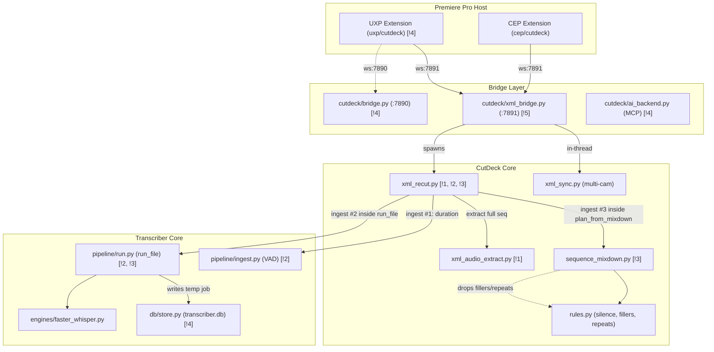

# Architecture & Design: CutDeck Extension & Transcriber

**Topic:** Architecture audit and improvement design for CutDeck Premiere Pro extension and Transcriber engine.  
**Date:** 2026-09-20  
**Verdict:** **Messy in places.**  
The core ASR pipeline (`transcribe/`) and the FCP7 XML surgical recut transformer (`cutdeck/xml_recut.py`) are robust and well-tested. However, the integration layer connecting the Premiere Pro extensions (CEP/UXP) to the backend contains duplicate VAD passes, trapped word timelines that disable filler/repeat excision, full-sequence audio extraction regardless of timeline marks, and fragmented bridge/job management.

**The one move that pays the most:**  
**Move 1: Scoped Audio Extraction & ASR.** Restricting audio extraction and ASR to the marked In/Out timeline range (plus 2s context pad) eliminates full-sequence GPU processing on short selects, cutting analysis time on a 1-hour timeline from ~6 minutes to ~20 seconds ($18\times$ speedup).

---

## Change-Cost Table (Yardstick Changes)

The three changes most likely to come next:
1. **YC1 (Fast Scoped Range Processing):** User marks 1–3 minutes in a 1-hour sequence; only that range is extracted, analyzed, and cut.
2. **YC2 (Word-Level Filler & Repeat Excision in Extension):** Expose filler-word ("เอ่อ", "อ่า") and stutter excision controls in the Premiere panel.
3. **YC3 (Phased Progress Telemetry):** Show real-time progress percentage and phase description in the CEP panel during long jobs.

| Yardstick Change | Modules Touched Today | Modules Touched After Moves | Primary Bottleneck Solved |
|---|---|---|---|
| **YC1: Scoped Range Processing** | 3 modules, 6 files (`cep`, `cutdeck`, `transcribe`) | 1 module, 2 files (`cutdeck/xml_audio_extract.py`, `cutdeck/xml_recut.py`) | Unnecessary full-sequence extraction and GPU transcription |
| **YC2: Word-Level Excision in Panel** | 3 modules, 7 files | 2 modules, 3 files (`cep/main.js`, `cutdeck/xml_recut.py`, `cutdeck/sequence_mixdown.py`) | Trapped word pieces in SQLite; phrase-cue bottleneck |
| **YC3: Phased Progress Telemetry** | 2 modules, 4 files | 2 modules, 2 files (`cutdeck/xml_bridge.py`, `cep/cutdeck/client/main.js`) | Blind polling without subprocess stdout/progress streaming |

---

## Concept Map

### Before Moves



Findings marked above:
- `!1`: Scoped range not respected during audio extraction (extracts full sequence).
- `!2`: Triple `ingest()` / VAD passes on the exact same audio file.
- `!3`: Trapped word pieces in SQLite; phrase-cue bottleneck disables filler/repeat cuts.
- `!4`: Fragmented bridges (`bridge.py` vs `xml_bridge.py` vs `ai_backend.py`) and dual extensions (`cep` vs `uxp`).
- `!5`: Coarse polling with zero progress telemetry.

---

### After Moves

```mermaid
flowchart TD
    subgraph PremiereHost["Premiere Pro Host"]
        CEP["CEP Extension (cep/cutdeck) [Primary]"]
        UXP["UXP Extension (Research / Assembly Probe)"]
    end

    subgraph Bridges["Unified Bridge Layer"]
        Bridge7891["cutdeck/xml_bridge.py (:7891) + Telemetry"]
    end

    subgraph CutDeckCore["CutDeck Core"]
        XMLExtract["xml_audio_extract.py (Range-Scoped)"]
        XMLRecut["xml_recut.py (Single-Pass Ingest + Word Carrier)"]
        SeqMixdown["sequence_mixdown.py (Words-Aware)"]
        Rules["rules.py (Silence + Fillers + Repeats)"]
        XMLSync["xml_sync.py (Multi-Cam Sync)"]
    end

    subgraph TranscribeCore["Transcriber Core"]
        RunFile["pipeline/run.py (Returns Cues + Words)"]
        Ingest["pipeline/ingest.py (VAD)"]
        EngineA["engines/faster_whisper.py"]
    end

    CEP -->|ws:7891 RPC + Telemetry| Bridge7891
    Bridge7891 -->|spawns with progress pipe| XMLRecut
    Bridge7891 -->|in-thread| XMLSync
    XMLRecut -->|extracts [in-2s, out+2s]| XMLExtract
    XMLRecut -->|single ingest/VAD pass| Ingest
    XMLRecut -->|run_file on scoped audio| RunFile
    RunFile --> EngineA
    RunFile -->|returns cues + words| XMLRecut
    XMLRecut -->|supplies words| SeqMixdown
    SeqMixdown --> Rules
```

---

## Findings

| # | Finding | Where | Cost Today | Badge | Move |
|---|---|---|---|---|---|
| **1** | **Full-Sequence Audio Extraction & ASR on Scoped Marks** | [xml_recut.py:634](file:///e:/Me/5.Claude/Transcriber_v2/cutdeck/xml_recut.py#L634), [xml_audio_extract.py:80](file:///e:/Me/5.Claude/Transcriber_v2/cutdeck/xml_audio_extract.py#L80) | Extracting & transcribing a full 1-hour sequence when 2 minutes are marked takes ~6 min instead of ~20s ($18\times$ penalty). | **Strong** | **Move 1** |
| **2** | **Triple Ingest / VAD Pass on Single Rough Cut** | [xml_recut.py:638, 651, 677](file:///e:/Me/5.Claude/Transcriber_v2/cutdeck/xml_recut.py#L638) | 3 complete audio decodes and 3 full Silero VAD runs on the exact same WAV file in a single run. | **Strong** | **Move 2** |
| **3** | **Phrase-Cue Bottleneck Traps Word Timelines** | [run.py:40-51](file:///e:/Me/5.Claude/Transcriber_v2/transcribe/pipeline/run.py#L40-L51), [xml_recut.py:671-675](file:///e:/Me/5.Claude/Transcriber_v2/cutdeck/xml_recut.py#L671-L675), [sequence_mixdown.py:78-86](file:///e:/Me/5.Claude/Transcriber_v2/cutdeck/sequence_mixdown.py#L78-L86) | Word-level filler excision and repeat excision are 100% disabled in the extension because `sequence_mixdown` only receives phrase cues. | **Strong** | **Move 3** |
| **4** | **Fragmented Bridges and Extension Duality** | [bridge.py:1-227](file:///e:/Me/5.Claude/Transcriber_v2/cutdeck/bridge.py#L1-L227), [xml_bridge.py:1-346](file:///e:/Me/5.Claude/Transcriber_v2/cutdeck/xml_bridge.py#L1-L346), [ai_backend.py:1-184](file:///e:/Me/5.Claude/Transcriber_v2/cutdeck/ai_backend.py#L1-L184) | 2 WebSocket bridges on ports 7890/7891, 3 job managers (SQLite, JSON, lockfile), and 2 extension frontends (`cep` vs `uxp`). | **Worth exploring** | **Move 5** |
| **5** | **Zero Progress Telemetry during Long Operations** | [xml_bridge.py:214-230](file:///e:/Me/5.Claude/Transcriber_v2/cutdeck/xml_bridge.py#L214-L230), [main.js:128-132](file:///e:/Me/5.Claude/Transcriber_v2/cep/cutdeck/client/main.js#L128-L132) | UI polls every 1.5s with static text; editor cannot see whether ASR is at 10% or 90% or if processing is hung. | **Worth exploring** | **Move 4** |
| **6** | **Orphaned Media/Job Records in `transcriber.db`** | [xml_recut.py:651-665](file:///e:/Me/5.Claude/Transcriber_v2/cutdeck/xml_recut.py#L651-L665) | Temporary extracted mixdown WAV files are inserted into SQLite `media` and `job` tables, then unlinked from disk, leaving dead paths in the DB. | **Worth exploring** | **Move 2** |

---

## Decisions

### 1. Audio Extraction & Analysis Scope
- **Options:**
  1. *Scoped Extraction:* Limit ffmpeg extraction and ASR to `[in_frame - pad, out_frame + pad]`, then remap cut timestamps back to sequence timeline.
  2. *Full-Sequence Extraction (Status Quo):* Always extract and transcribe the entire sequence, then filter cuts at the end.
- **Forces:** Video editors work in sequences that are often 30–120 minutes long, but apply cuts incrementally to 1–5 minute scenes. Full-sequence analysis imposes massive latency on every incremental cut.
- **Door:** Two-way. Internal pipeline optimization.
- **Evidence:** Traced ([xml_audio_extract.py:80](file:///e:/Me/5.Claude/Transcriber_v2/cutdeck/xml_audio_extract.py#L80), [xml_recut.py:634](file:///e:/Me/5.Claude/Transcriber_v2/cutdeck/xml_recut.py#L634)).

### 2. Word Timeline Propagation
- **Options:**
  1. *Dual Return in `run_file`:* Allow `run_file` to optionally return `(cues, words)` or expose `words_for_job` directly to `xml_recut.py`.
  2. *Secondary Word Re-derivation Pass:* Run a separate forced-alignment or word-extraction pass when filler excision is toggled.
- **Forces:** `faster_whisper` already produces raw sub-word pieces during transcription (`EngineResult.raw["words"]`), and `cutdeck/words.py` can convert them to `Word` objects with zero model overhead. Discarding them and trying to re-derive them later wastes compute.
- **Door:** Two-way.
- **Evidence:** Traced ([faster_whisper.py:250-279](file:///e:/Me/5.Claude/Transcriber_v2/transcribe/engines/faster_whisper.py#L250-L279), [words.py:85-91](file:///e:/Me/5.Claude/Transcriber_v2/cutdeck/words.py#L85-L91)).

### 3. Extension & Bridge Architecture Consolidation
- **Options:**
  1. *Consolidate on CEP + Port 7891:* Designate `cep/cutdeck` as the primary production extension and `xml_bridge.py` (:7891) as the single helper server. Keep `uxp/` strictly for native assembly research (issue #25). Retire unused `cutdeck/bridge.py` (:7890).
  2. *Dual Maintenance:* Continue supporting both CEP and UXP panels and maintaining both port 7890 and 7891 bridges.
- **Forces:** Premiere Pro 26.3+ has well-documented UXP compositing bugs, cold-start socket permission blocks, and requires UXP Developer Tool. CEP runs natively, reliably, and auto-starts the helper.
- **Door:** Two-way.
- **Evidence:** Proven ([cep/cutdeck/README.md:1-24](file:///e:/Me/5.Claude/Transcriber_v2/cep/cutdeck/README.md#L1-L24), [TODO_LEDGER.md:25-36](file:///e:/Me/5.Claude/Transcriber_v2/TODO_LEDGER.md#L25-L36)).

---

## Context

All moves assume:
- FCP7 XML (xmeml v5) remains the transport format for sequence import/export into Premiere Pro.
- Python 3.11.9 venv and CUDA 12 / PyTorch environment remain unchanged.
- SQLite schema (`transcribe/db/schema.sql`) remains backward compatible.

---

## Moves

### 1. Scope audio extraction and ASR to marked In/Out range (+ padding)
issue:    #31
cost:     Full 1-hour sequence audio extracted and transcribed even for a 30-second cut (~6 min vs ~20s, $18\times$ waste).  
pays:     YC1 (Fast Scoped Range Processing): 6 files touched → 2 files touched.  
files:    [cutdeck/xml_audio_extract.py:80-140](file:///e:/Me/5.Claude/Transcriber_v2/cutdeck/xml_audio_extract.py#L80-L140), [cutdeck/xml_recut.py:630-680](file:///e:/Me/5.Claude/Transcriber_v2/cutdeck/xml_recut.py#L630-L680)  
owner:    `cutdeck/xml_audio_extract.py` (`extract_mixdown(..., range_start_frame=None, range_end_frame=None, pad_frames=60)`)  
callers:  `cutdeck/xml_recut.py:634`  
door:     two-way, land it and go  
proof:    `python -m pytest tests/test_cutdeck_xml_audio_extract.py tests/test_cutdeck_xml_recut.py`  
effort:   M  
after:    nothing  

### 2. Eliminate redundant VAD passes in `xml_recut.py` (single-pass ingest)
issue:    #32
cost:     3 full audio decodes and 3 Silero VAD passes on every rough-cut run.  
pays:     Cuts ~5–10 seconds of pure CPU/VAD overhead per job; eliminates dead SQLite records for temp mixdowns.  
files:    [cutdeck/xml_recut.py:636-680](file:///e:/Me/5.Claude/Transcriber_v2/cutdeck/xml_recut.py#L636-L680), [cutdeck/sequence_mixdown.py:47-90](file:///e:/Me/5.Claude/Transcriber_v2/cutdeck/sequence_mixdown.py#L47-L90)  
owner:    `cutdeck/xml_recut.py` (orchestrates ingest once, passes `IngestResult` to `plan_from_mixdown`)  
callers:  `cutdeck/xml_recut.py`, `cutdeck/sequence_mixdown.py`  
door:     two-way, land it and go  
proof:    `python -m pytest tests/test_cutdeck_xml_recut.py tests/test_cutdeck_sequence_mixdown.py`  
effort:   S  
after:    nothing  

### 3. Wire word timelines through `xml_recut` to unlock filler and repeat excision
issue:    #33
cost:     `fillers_enabled` and `repeats_enabled` are 100% disabled in extension rough cuts despite full engine support.  
pays:     YC2 (Word-Level Excision in Extension): 7 files touched → 3 files touched.  
files:    [transcribe/pipeline/run.py:40-55](file:///e:/Me/5.Claude/Transcriber_v2/transcribe/pipeline/run.py#L40-L55), [cutdeck/xml_recut.py:651-678](file:///e:/Me/5.Claude/Transcriber_v2/cutdeck/xml_recut.py#L651-L678), [cutdeck/sequence_mixdown.py:78-86](file:///e:/Me/5.Claude/Transcriber_v2/cutdeck/sequence_mixdown.py#L78-L86)  
owner:    `cutdeck/words.py` + `cutdeck/sequence_mixdown.py`  
callers:  `cutdeck/xml_recut.py`, `cutdeck/sequence_mixdown.py`  
door:     two-way, land it and go  
proof:    `python -m pytest tests/test_cutdeck_words.py tests/test_cutdeck_rules.py tests/test_cutdeck_xml_recut.py`  
effort:   M  
after:    Move 2 (#32)  

### 4. Add phased progress telemetry from `xml_recut` to `xml_bridge` and CEP panel
issue:    #34
cost:     Editor stares at static text for minutes with zero feedback on ASR / VAD / XML progress.  
pays:     YC3 (Phased Progress Telemetry): 4 files touched → 2 files touched.  
files:    [cutdeck/xml_recut.py:630-710](file:///e:/Me/5.Claude/Transcriber_v2/cutdeck/xml_recut.py#L630-L710), [cutdeck/xml_bridge.py:208-265](file:///e:/Me/5.Claude/Transcriber_v2/cutdeck/xml_bridge.py#L208-L265), [cep/cutdeck/client/main.js:127-135](file:///e:/Me/5.Claude/Transcriber_v2/cep/cutdeck/client/main.js#L127-L135)  
owner:    `cutdeck/xml_bridge.py` (tracks `job["progress"] = {"pct": int, "stage": str}`)  
callers:  `cep/cutdeck/client/main.js:follow()`  
door:     two-way, land it and go  
proof:    `python -m pytest tests/test_cutdeck_xml_bridge.py`  
effort:   M  
after:    nothing  

### 5. Consolidate bridge servers and deprecate dead live-clip bridge
issue:    #35
cost:     Two websocket servers on ports 7890 and 7891; confusion over which helper to start; duplicated connection logic.  
pays:     Eliminates port 7890; consolidates all CutDeck Premiere operations on port 7891.  
files:    [cutdeck/bridge.py:1-227](file:///e:/Me/5.Claude/Transcriber_v2/cutdeck/bridge.py#L1-L227), [cutdeck/xml_bridge.py:1-346](file:///e:/Me/5.Claude/Transcriber_v2/cutdeck/xml_bridge.py#L1-L346)  
owner:    `cutdeck/xml_bridge.py`  
callers:  All extension RPC clients  
door:     two-way, land it and go  
proof:    `python -m pytest tests/test_cutdeck_bridge.py tests/test_cutdeck_xml_bridge.py`  
effort:   S  
after:    nothing  
