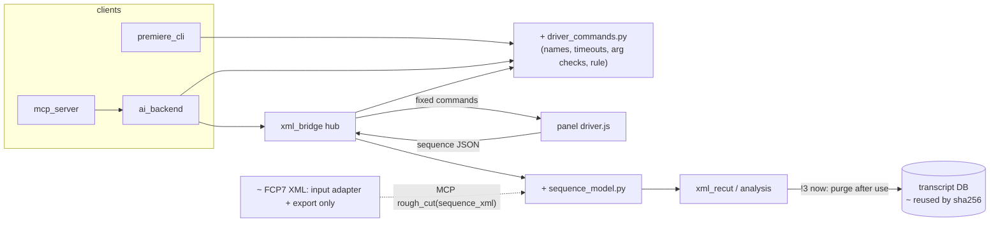

# Architecture & Design: CutDeck helper, what a replacement should be

Date: 2026-09-25. Scope: the helper (`cutdeck/xml_bridge.py`, `ws://127.0.0.1:7891`), its
clients (`cutdeck/ai_backend.py`, `cutdeck/mcp_server.py`, `cutdeck/premiere_cli.py`), the
panel's driver (`uxp/cutdeck/features/driver.js`) and the rough-cut analysis it launches
(`cutdeck/xml_recut.py`, `cutdeck/sequence_json.py`, `cutdeck/xml_sequence.py`). Follows
`docs/arch-design-helper-v2.md`, whose decisions stand.

## Verdict

**Messy in places, not tangled. Don't replace the helper.** v2's shape (one socket with
request ids, pushed events, a GPU lane and a CPU lane, jobs on disk, the panel as a
fixed-command Premiere driver) is still the right one. A new design would rebuild it and drop
the live fixes built into it. Three things cost real time today, and each has a move:

1. **Re-running a rough cut transcribes everything again.** Every rough cut with speech
   protection runs ASR over the whole mixdown, then purges the result
   (`xml_recut.py:650-691`). `run_file` resumes only *failed* jobs (`run.py:88-99`), so a
   second run with a different preset or the same range starts over. **This move saves the
   most time for you (move 2).**
2. **A Premiere command is defined in five files in two languages** (move 1, the cheapest).
3. **FCP7 XML is still passed around inside the helper.** The panel sends JSON, and
   `sequence_json.to_fcp7_xml` turns it back into XML so five XML readers can parse it again
   (moves 3 and 4).

**Withdrawn from the chat proposal:** a stored plan/inverse-op log for undo. It fails the
deletion test. Premiere already gives one Ctrl+Z per transaction (`add_markers`: 1 undo step,
`driver.js:59-70`). `apply_cuts` cuts a *copy* (`driver.js:48`). The MCP client already asks
permission for every `write` tool (`mcp_server.py:84-96`). What's left is a rule, not a
subsystem. It goes into move 1's command table: every driver command runs as one transaction
or on a copy.

## Change cost

| Yardstick change (source) | Modules touched now | After the moves |
|---|---|---|
| Expose a panel feature (frame hold, AL, color matte) as a Premiere command for agents/CLI (chat 2026-09-25; last 5 commits are all panel features) | 5 source files: `driver.js`, `xml_bridge.py`, `ai_backend.py`, `mcp_server.py`, `premiere_cli.py` | 3: `driver_commands.py`, `driver.js`, `mcp_server.py` |
| Re-run a rough cut on the same sequence/range with another preset (the panel's preset toggle, `xml_bridge.py:516`) | 1 full ASR pass over the mixdown | 0 ASR passes (cache hit) |
| A new analysis over the sequence's clips, e.g. markers at pauses (chat 2026-09-25) | parse FCP7 via `xml_sequence.py` + `xml_audio_extract.py` + a new branch in `xml_bridge.py` | read the typed `sequence_model` + a new branch in `xml_bridge.py` |
| An agent edit that can be previewed and undone (chat 2026-09-25) | already covered: copy / 1 undo step / MCP permission | no change (rule recorded in move 1) |

Not read on purpose: the transcription pipeline beyond `run_file`'s resume path, the panel
features (`align`, `adjust`, `transform/`), the eval harness.

## Concept map

Before (findings marked `!N`):

| Concept | Owner(s) | Where |
|---|---|---|
| Driver command list !1 | panel `COMMANDS` + `handlers`; helper `DRIVER_COMMANDS` + arg branch; `ai_backend` tool list; MCP tools; CLI `choices` | `driver.js:18,73`; `xml_bridge.py:40,197,466`; `ai_backend.py:40-42`; `mcp_server.py:73-96`; `premiere_cli.py:24-41` |
| Sequence clips (the analysed timeline) !2 | panel JSON → `sequence_json.validate` → `to_fcp7_xml` → `source.xml` read by `range_from_ticks`, `reference_audio_track`/`audio_track_groups`, `check_reference_audio`, `extract_mixdown`, `xml_recut.main` | `xml_bridge.py:92,55,306-312,506`; `xml_sequence.py:86,193`; `xml_audio_extract.py:45` |
| Rough-cut transcript !3 | made per job, purged per job | `xml_recut.py:650-691` |
| Transcript reuse by sha256 | `run_file`, failed jobs only | `transcribe/pipeline/run.py:88-99`, `store.create_media` `store.py:306` |
| Job lifecycle, lanes, events | `XmlJobs` | `xml_bridge.py:238-500` |
| Cut semantics (keep/shift) | `xml_recut.py` (XML export) + `cutPlanApply.js` (native), kept equal by a golden | `tests/cutdeck_cut_plan_apply.test.cjs:29` (not a finding: guarded) |

After:

| Concept | Owner | Change |
|---|---|---|
| Driver command list | `cutdeck/driver_commands.py` (+ the panel handler that does the work) | ~ one table, checked against `driver.js` by a test |
| Sequence clips | `cutdeck/sequence_model.py`; FCP7 XML only as an input adapter (`from_fcp7_xml`) and the existing export | ~ |
| Rough-cut transcript | the transcript DB, keyed by mixdown sha256 | ~ kept, reused |
| Everything else | unchanged | |

Legend: `+` added · `~` changed · `!N` finding · dashed = secondary route.

## Findings

| # | Finding | Where | Cost today | Badge | Move |
|---|---|---|---|---|---|
| !1 | One command, five owners in two languages | table above | 5 source files + 3 test files per new command (rehearsed with `add_markers`: `grep add_markers`) | Strong | 1 |
| !3 | Rough-cut transcript is thrown away; re-runs transcribe again | `xml_recut.py:650-691`, `run.py:88-99` | 1 full ASR pass per re-run (wall time not measured this session) | Strong | 2 |
| !2 | JSON → FCP7 XML → parse again, inside the helper | `xml_bridge.py:306-312`, `sequence_json.py:1-18` | 5 readers depend on FCP7; stereo tracks split and regrouped (`audio_track_groups`) | Worth exploring (pays only if new sequence analyses come) | 3, 4 |
| — | Stored inverse-op log for agent undo | chat proposal | 0: Premiere undo + copy + MCP permission cover it | Speculative, withdrawn | rule in 1 |
| — | `xml_bridge.dispatch` is a hotspot (16 changes, 735 lines) | `xml_bridge.py:259-383` | splitting it into a handler dict only moves the branches | fails deletion test | none |

## Decisions

| Decision | Options | Forces | Door | Evidence |
|---|---|---|---|---|
| Replace the helper or evolve it | A rewrite; **B moves on v2** | v2 was live-proven on 2026-09-24; live fixes are built into its code | rewrite = one-way (loses proven behaviour) | traced: `arch-design-helper-v2.md` status table |
| One command source | A: hand lists + a drift test; **B: one Python table, panel names checked by test** | A catches drift but doesn't cut the 5 edits; the panel handler is irreducible | two-way | traced: files in !1 |
| MCP tools generated from the table | A: generate them; **B: keep hand-written** | typed signatures are the agents' docs; generating them needs FastMCP custom-schema support (not checked this session) | two-way | suspected (not checked), so not planned |
| Transcript reuse | **A: reuse by mixdown sha256**; B: transcribe each source file once and map words through clip ranges | B reuses across sequences, but a mixdown hears the mix and a source file hears one mic, so the words differ where speech overlaps | A two-way (a cache); B changes what gets transcribed | traced: `xml_recut.py:650-691`, `run.py:88-99`; mixdown determinism suspected, so it's move 2's first proof |
| Internal sequence format | **A: typed model, XML only at the edge**; B: keep FCP7 internally | prepared jobs on disk hold `source.xml`: need a read fallback | two-way with the fallback | traced: `xml_bridge.py:369-375` |
| Inverse-op log | A build; **B don't** | covered by existing undo/copy/permission | — | traced: `driver.js:48,59-70` |

## Context

Every move assumes: the socket protocol, lanes, durable jobs and the panel-as-driver stay as
v2 built them; `VERSION` changes only if the panel↔helper messages change (none of these
moves change them); ExtendScript, the C++ add-on and a warm GPU worker stay out; the FCP7 XML
*export* (`xml_recut.recut`, `export_mode.py`) stays; the transcription pipeline's behaviour is
unchanged.

## Moves

### 1. One table owns the Premiere driver commands
issue:    #60
cost:     a new command touches 5 source files in 2 languages (`driver.js:18,73`, `xml_bridge.py:40,197-216,466-472`, `ai_backend.py:40-42`, `mcp_server.py:73-96`, `premiere_cli.py:24-41`)
pays:     "expose frame hold to agents": 5 files → 3 (`driver_commands.py`, `driver.js` handler, one MCP tool)
files:    new `cutdeck/driver_commands.py`: `COMMANDS = {name: Command(timeout_s, prepare, cli_target, doc)}`, where `prepare(args, jobs) -> panel_args` holds today's `_marker_arguments` and the `apply_cuts` job lookup (`xml_bridge.py:458-472`). Its module docstring states the rule: every command runs as one Premiere transaction or on a copy, and returns what it changed. `xml_bridge.py`: `DRIVER_COMMANDS` and `_call_driver`'s if/elif read the table. `premiere_cli.py`: `choices` and `run` loop over the table. `ai_backend.capabilities`: `premiere_*` tools listed from the table
owner:    `cutdeck/driver_commands.py`
callers:  `xml_bridge.dispatch` (`register_driver` check `:278`, `_call_driver` `:449-480`), `premiere_cli.main/run`, `ai_backend.capabilities`; `mcp_server.py` tools unchanged
door:     two-way, land it and go (internal; wire messages identical)
proof:    `python -m pytest tests/test_cutdeck_helper_v2.py tests/test_cutdeck_panel_wire.py -q` and `node --test tests/cutdeck_driver.test.cjs` green, unchanged. Add `tests/test_cutdeck_driver_commands.py`: the `COMMANDS = [...]` array read from `uxp/cutdeck/features/driver.js` by regex equals `sorted(driver_commands.COMMANDS)`, and every table entry has a `premiere_<name>` tool in `ai_backend.capabilities()["tools"]` and in `mcp_server.create_server` tool names
effort:   S
after:    nothing

### 2. Reuse the rough-cut transcript when the mixdown is the same
issue:    #61
cost:     every rough cut with speech protection runs a full ASR pass over the mixdown and then purges it (`xml_recut.py:650-691`); `run_file` only resumes *failed* jobs (`transcribe/pipeline/run.py:88-99`)
pays:     "re-run the same sequence/range with the other preset": 1 ASR pass → 0
files:    `cutdeck/xml_recut.py:650-691`: before `run_file`, look up a `written` job for this mixdown's media (sha256 via `store.create_media`, `store.py:306`) with the same engine pair and `PIPELINE_VERSION`; on a hit, read tokens and `words_for_job` from it and skip `run_file`. Stop purging transcript data for rough-cut mixdowns (`store.purge_job_transcript_data` call at `:684-689`). The lookup is a new typed function in `transcribe/db/store.py` (the only place raw SQL may live), e.g. `find_finished_job(conn, media_id, engine_a, engine_b, pipeline_version)` beside `find_resumable_job`
owner:    `transcribe/db/store.py` (lookup); `xml_recut.main` (use)
callers:  `xml_recut.main` only (the helper runs it as a child, `xml_bridge.py:515`)
door:     two-way: a cache. Rollback is to restore the purge call; stored rows can be dropped with the existing `purge_job_transcript_data`. The DB grows by one transcript per distinct mixdown, which reverses the "would otherwise pile up" choice at `:681-683`. Tell the user about that trade before landing
proof:    first, the precondition: extract the same sequence+range twice (`xml_audio_extract.extract_mixdown` on `tests/fixtures/cutdeck_recut_sample_scrubbed.xml`) and show both WAVs have the same sha256. If they differ, stop: key on the source (sequence JSON + range + config hash) instead. Then: a pytest with the `mock` engine runs `xml_recut.main --asr --cuts-json` twice on one fixture; the second run makes 0 `run_file` calls (monkeypatched counter) and writes a byte-identical `cuts.json`. Live: time two rough cuts of one sequence in Premiere; the second skips the "Transcribing speech" stage
effort:   M
after:    nothing

### 3. The analysis reads a typed sequence model; FCP7 XML becomes an input adapter
issue:    #62
cost:     the panel's JSON is converted into FCP7 XML (`xml_bridge.py:306-312`, `sequence_json.to_fcp7_xml`) and 5 readers parse it back: `range_from_ticks` `:92`, `reference_audio_track`/`audio_track_groups` `:55`/`xml_sequence.py:86`, `check_reference_audio` `xml_sequence.py:193`, `extract_mixdown` `xml_audio_extract.py:45`, `xml_recut.main`'s timebase/length
pays:     "a new analysis over the sequence's clips": no FCP7 parsing, no stereo-split regrouping
files:    new `cutdeck/sequence_model.py`: frozen dataclasses `Sequence(ticks_per_frame, end_ticks, tracks)`, `Track(index, muted, clips)`, `Clip(path, start_ticks, end_ticks, in_ticks, out_ticks, enabled)`, built by today's `sequence_json.validate`; `from_fcp7_xml(xml) -> Sequence` built from the existing `xml_sequence` readers. The 5 readers above take a `Sequence`
owner:    `cutdeck/sequence_model.py`
callers:  the 5 readers above; `xml_bridge._start`/`_run`; `xml_recut.main` (its CLI still takes a `.xml` path → `from_fcp7_xml`); MCP `rough_cut(sequence_xml)` (`ai_backend`) through the same adapter
door:     two-way (internal; XML still accepted at the edge)
proof:    `python -m pytest tests/test_cutdeck_sequence_json.py tests/test_cutdeck_xml_recut_cli.py tests/test_cutdeck_xml_bridge.py -q` green. A new golden: for the real export `tests/fixtures/cutdeck_recut_sample_scrubbed.xml`, `from_fcp7_xml(export)` and `validate(panel_json)` give equal `Sequence`s, and `cuts.json` from both routes matches frame for frame
effort:   L
after:    nothing (independent of 1 and 2)

### 4. Prepared jobs store `sequence.json`, not `source.xml`
issue:    #63
cost:     `prepare` writes `source.xml` only for move 3's readers (`xml_bridge.py:306-312`); `start` and `_run` read it back (`:369-375`, `:506`)
pays:     removes the last JSON→XML conversion; `to_fcp7_xml` keeps no caller and is deleted with this move (it's orphaned by this change)
files:    `xml_bridge.py` `prepare`/`start`/`_run`; `sequence_json.py` (drop `to_fcp7_xml`)
owner:    `cutdeck/sequence_model.py`
callers:  `XmlJobs.dispatch` `prepare`/`start`, `XmlJobs._run`
door:     two-way *with* a fallback: job folders on disk from before this move hold `source.xml`, so `start`/`_run` read `sequence.json` if present, else `from_fcp7_xml(source.xml)`
proof:    the move-3 tests green, plus `test_a_job_prepared_before_the_upgrade_still_starts`: a job folder with only `source.xml` and `state: prepared` starts and produces the same `cuts.json`
effort:   S
after:    3
