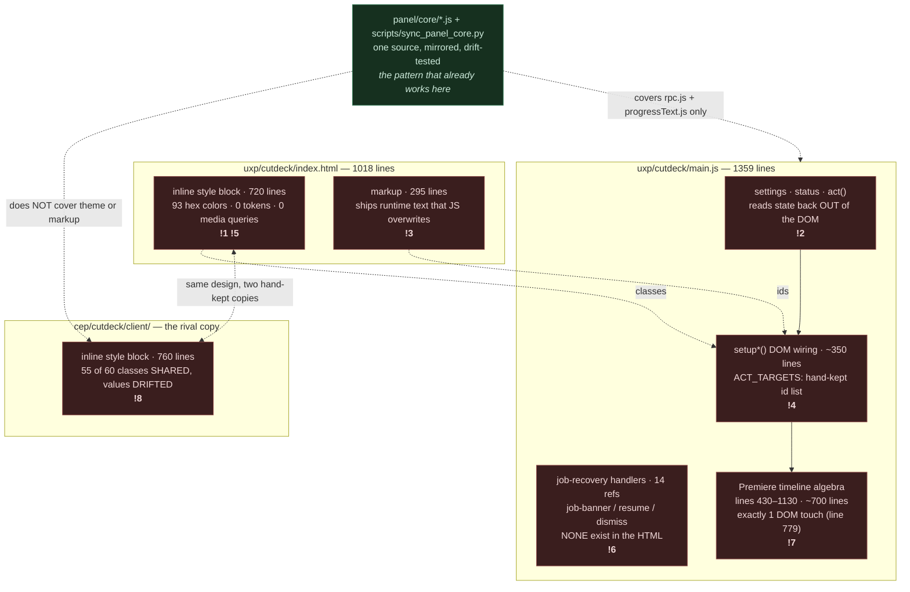
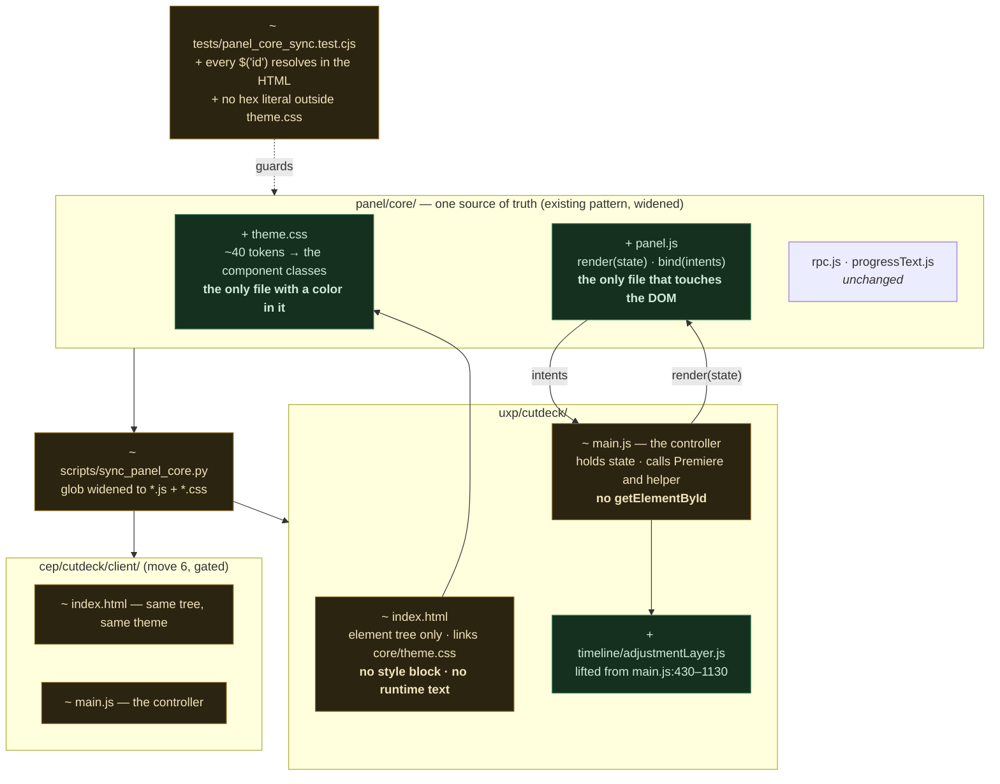

# CutDeck UXP panel — UI audit & module design

> **Superseded note (issues #41, #49):** `cep/` and the `panel/core/` mirror have been
> deleted — UXP is now the only panel, and UI source files live directly in `uxp/cutdeck/core/`
> (issue #49). Every comparison against "the CEP copy" or mention of `panel/core/` below is
> historical (this audit predates the deletions); the "One panel or two" decision resolved
> to (b), and the HELD move at the end of this doc is moot.

**Scope.** The UXP panel's user interface: `uxp/cutdeck/index.html` and the DOM-touching parts of
`uxp/cutdeck/main.js`, with `cep/cutdeck/client/` compared at the class/id level as the rival copy.

**Deliberately not read:** `assembleProbe.js`, `capabilityProbe.js`, `timelineRange.js`,
`assemblyPlan.js`, `workflow.js`, `helperStart.js`, `probe.js`, `cep/cutdeck/jsx/host.jsx`. They
cannot affect the panel's layout — `grep -ln 'document\.|getElementById|innerHTML|classList'
uxp/cutdeck/*.js uxp/cutdeck/core/*.js` returns **`main.js` and nothing else** (*proven*). The UI
surface is exactly two files.

*Evidence labels: **proven** = ran it · **traced** = read the whole chain · **suspected** = neither.*

---

## Verdict

**Messy in one specific way: there is no UI module.** Not "it's in the wrong file" — there is no
boundary at all. The panel's UI is three separate concerns with no owner between them:

| concern | where it lives today | size |
|---|---|---|
| theme (color, space, type) | inline `<style>` in `index.html:6-719` | 720 lines, **93 unique hex colors over 132 uses, 0 variables, 0 `@media`** |
| markup | `index.html:721-1017` | 295 lines — and it carries *runtime text* that JS overwrites |
| DOM wiring | `main.js:9-66, 196-429, 1131-1359` | ~350 lines, interleaved with ~700 lines of Premiere timeline algebra |

### Your question, answered directly

> *"I don't know if it has its own file or not"*

**It does not.** And that is the whole cause of the second half of your sentence.

> *"I feel like it shifts every time I adjust something"*

Both senses of "shift" are real and both come from the missing boundary:

**Authoring shift** — you adjust one value and its near-twins stay behind. `.tab-btn.active` is
`#272e2b`, `.action-card:hover` is `#2a2e2b`, `.icon-btn:hover` is `#272e2a`, `.dropdown-item:hover`
is `#27312b`. Four hand-picked shades of the same grey, no name between them. 93 colors for what is
really about 6 surface levels (*proven*: `grep -oE "#[0-9a-fA-F]{6}" uxp/cutdeck/index.html | sort -u | wc -l` → 93).
Spacing is the same: `margin-top` takes 2, 3, 4, 7 and 8px with no scale.

**Visual shift** — five mechanisms, below.

**The one move that pays most:** give the panel a real UI seam — `core/theme.css` for every visual
value, `panel.js` owning every DOM touch, and one rule that kills a whole class of bug: *state is
never read back out of the DOM.* Today it is, in six places (`main.js:190, 191, 1225, 1226, 1238, 1320`).

---

## Why it visually shifts — the five mechanisms

| # | mechanism | evidence | how sure |
|---|---|---|---|
| **S1** | **The status card grows in flow.** `#status` is `white-space: pre-wrap`; `.status-card` has `min-height: 28px` and no max. Messages run from `"Ready"` (1 line) to 4 lines (`follow()`'s sync report) to *unbounded* (`probe.run()` emits one line per URL tested). It is the last element in flow, so it pushes the page taller; once content exceeds the panel, `body { overflow-y: auto }` adds a scrollbar, the content box narrows, and **everything above re-wraps horizontally**. | `index.html:9-19, 438-465`; `main.js:86-102, 152-159, 1310-1315` | traced |
| **S2** | **Each tab is a different height.** `.view-panel { display: none }` / `.active { display: block }`. `#view-edit` and `#view-adj` have unrelated content, so `.status-card` below them sits at a different y per tab — it jumps the moment you switch. | `index.html:157-164, 806-897`; `main.js:199-221` | traced |
| **S3** | **Authored markup is overwritten at load.** The HTML ships `⚡ 16f (50/50)` and `✦ Active: Zoom In`; `updateUIFromSettings()` runs at init and writes `16f (50/50)` and `Zoom In` — the icons vanish on first paint and the widths change. `#assembleprobe` ships the short `Run assemble probe`, and `disarmAssemble()` writes back the *longer* `Run assemble probe (MUTATES — disposable projects only)` — so after the first arm/disarm that row is permanently taller. **What you see in `index.html` is not what is on screen.** | HTML `885, 888, 1011` vs JS `60, 63, 1285, 1293`; init at `1347-1348` | proven |
| **S4** | **No responsive rules at all.** `grep -c "@media"` → **0**. Panel width is user-dragged (manifest `minimumSize.width: 300`, `preferredDockedSize.width: 340`). `.frame-stepper-group` is `flex-wrap: wrap`; `.action-cards-grid` is two `flex: 1` cards whose `.card-legend` rows re-wrap. Drag the panel a few px and card heights change, so everything below moves. | `index.html:277-300, 594-599`; `manifest.json:24-36` | traced |
| **S5** | **No tokens, so "one adjustment" is never one edit.** See above — 93 colors, 5 ad-hoc spacings. | `index.html:6-719` | proven |

S3 is almost certainly the one you *feel* as "I adjusted something and it shifted", because it fires
on the settings you touch most.

---

## Before — the concept map as it is



**Legend** — `!N` = numbered finding · red = problem · green = existing good structure to extend.

---

## Findings

| # | sign | where | what it costs today | move | effort |
|---|---|---|---|---|---|
| **!1** | No shared way — 93 hex colors, no tokens, no scale | `index.html:6-719` | Every visual adjustment is a hunt for near-twins; you miss one, it "shifts" | **2** | M |
| **!2** | The DOM is used as the state store | `main.js:190, 191, 1225, 1226, 1238, 1320` | `act()`'s `finally` re-reads `#status.textContent` and re-emits it; `#cut` reads `#mode.value` and `#audio.value`. State and pixels can't be reasoned about apart | **3** | M |
| **!3** | Two authors for the same text — HTML and JS | HTML `885, 888, 1011` vs JS `60, 63, 1285, 1293` | Icons disappear at load; the probe button permanently grows. **This is the shift you feel** | **3** | M |
| **!4** | `ACT_TARGETS` is a hand-maintained id array that has drifted | `main.js:161-166` | Contains `"resume"`/`"dismiss"` (don't exist). Omits `tools-toggle`, `menu-item-settings`, `menu-item-reload`, `seq-card`, `frame-dec`, `frame-inc`, `setting-*`, `.pill-mini` — **12+ controls stay live during a job**, so you can change `frames` mid-run. Meanwhile `close-settings` *is* disabled, so you can't close Settings while busy (Escape still works — `main.js:294-302`) | **3** | M |
| **!5** | Ad-hoc spacing | `margin-top` ∈ {2,3,4,7,8}px; radius ∈ {3,4,5,6,7,8}px | Nothing lines up; adjusting one gap doesn't move its neighbours | **2** | M |
| **!6** | **Dead UI + a wedge bug.** 14 refs to `#job-banner`/`#resume`/`#dismiss` in JS; **zero** in the HTML since commit `0f1e238` | `main.js:76-84, 1243-1270, 1343-1348`; absent from `index.html` | `#cut` throws *"Resume the previous job before starting another rough cut."* whenever `lastJob()` is truthy (`main.js:1220`), and the only path to `clearJob()` outside `follow()` is the **missing** `#dismiss` button. Reload the panel mid-job and Cut + Sync are blocked with no in-panel escape. CEP still has these controls (`cep/.../index.html:978-982`) | **4** | S |
| **!7** | One place doing everything — `main.js` is panel wiring *and* Premiere timeline algebra | `main.js:430-1130` (~700 lines, 1 DOM touch at `779`) | You can't read the UI without scrolling past tick arithmetic. **The seam is already 99% clean — it just isn't drawn** | **5** | M |
| **!8** | Same job, two places — the design system exists twice and has drifted | `uxp/.../index.html` vs `cep/.../client/index.html`: 55 of 60 classes shared; `.status-card`, `.badge-btn`, `.tab-btn.active`, `.pill-btn.active` all differ in value | Every visual change is done twice by hand — commit `dcc606f` ("…for UXP and CEP") is you paying this tax | **6** | L |
| **!9** | Mirrored state: the `sr-only` `#mode` select shadows `.pill-btn.active` | `index.html:867-870`; `main.js:223-241` | Low severity — one writer, one reader, stays consistent. Folds into move **3** for free | **3** | — |

---

## After — the same map with the moves applied



**Legend** — `+` added · `~` changed · green = new · amber = modified.

---

## The UI module — contract

| module | one-sentence responsibility | owns | must never know |
|---|---|---|---|
| `core/theme.css` | Every color, space, radius and type size the panel uses, as named tokens. | The token set and the component classes built from it. | What a sequence, a job, or an adjustment layer is. |
| `index.html` | The panel's element tree. | The DOM skeleton and its ids. | Any text that can change at runtime; any color literal. |
| `core/panel.js` | Turn panel state into what's on screen, and DOM events into intents. | **Every** `getElementById`, `classList`, `textContent`, `addEventListener` in the panel. | `ppro`, the helper RPC, ticks, tracks, job ids. |
| `main.js` | The controller: hold the state object, call Premiere and the helper, hand new state to `panel.js`. | The state object, the job lifecycle, `act()`. | CSS class names, element ids. |
| `timeline/adjustmentLayer.js` | Place adjustment layers on the active sequence. | Tick math, track selection, AL creation. | The DOM. |

*Boundary test:* someone could replace `panel.js` with a different rendering approach by reading only
the two signatures below. They could replace `theme.css` by reading only the token names.

```js
// core/panel.js — exports exactly two functions.

render(state)        // state -> screen. A pure sink: it writes the DOM and never reads it back.
                     // Called on every state change. Idempotent: render(s) twice == render(s) once.

bind(intents)        // intents = { onRefresh, onCut, onSync, onResumeJob, onDismissJob,
                     //             onTab(name), onCutMode(mode), onAdjust(mode), onEffect(mode),
                     //             onSettingChange(patch), onProbe(name) }
                     // Called once at init. Handlers receive intent data, never DOM events.
```

```js
// the state object main.js owns — panel.js's only input
{
  sequence:      { name, inSeconds, outSeconds, audioTrackCount } | null,
  tab:           "edit" | "adj",
  cutMode:       "protected" | "silence",     // replaces the sr-only #mode select  (!9)
  audioTrack:    number | null,                // replaces reading #audio.value      (!2)
  settings:      { frames, bin, color, clamp, activeFx, fxList },
  job:           { id, state } | null,         // drives the recovery row            (!6)
  busy:          boolean,                      // drives ALL disabling               (!4)
  status:        { text, level: "ready" | "busy" | "error" },
  menuOpen:      boolean,
  settingsOpen:  boolean,
  assembleArmed: boolean,
}
```

### Conventions

1. **State is never read out of the DOM.** `render` writes; nothing reads back. This single rule
   retires !2, !3, !4 and !9 at once.
2. **No color literal outside `theme.css`.** Enforced by a test (move 3's proof).
3. **No runtime text in `index.html`.** Any text `render` can change ships as an empty element.
4. **Disabling is derived, not listed.** `render` disables from `state.busy` by walking
   `[data-act]` attributes in the markup — no hand-kept id array.
5. **Shared files live in `panel/core/` and are mirrored, never edited in place** — the existing
   rule from `scripts/sync_panel_core.py`, extended to CSS.

### Requirement → structure

| requirement | the element that guarantees it |
|---|---|
| Adjusting one visual value adjusts everywhere it means the same thing | `theme.css` tokens + convention 2, tested |
| The panel does not jump when status text or the tab changes | Move 1's reserved status area + fixed view height |
| What `index.html` says is what is on screen | Convention 3 + `render` as sole text author |
| A panel reload mid-job is recoverable | `state.job` rendered as a recovery row (move 4) |
| The UXP and CEP panels look the same | One `theme.css` in `panel/core` + the existing drift test (move 6) |
| The Premiere API stays behind one boundary | `timeline/adjustmentLayer.js`, no DOM (move 5) |

---

## Decisions

| decision | options considered | forces | reversibility | evidence |
|---|---|---|---|---|
| **Where shared UI lives** | (a) `panel/core/` + `sync_panel_core.py`, widened to `*.css` — **adopted**; (b) a bundler (esbuild/vite) producing each panel; (c) leave duplicated | CEP loads via a directory junction and UXP zips its own folder, so **neither panel can reach a sibling folder at runtime** (`scripts/sync_panel_core.py:3-5`). (a) already works here and is drift-tested (`node --test tests/panel_core_sync.test.cjs` → 6/6, *proven*). (b) adds a build step to a repo that has none and buys nothing (a) doesn't. | Two-way door — it's a folder layout and a 20-line script. | proven: ran the test; read the script and both mirrors (byte-identical) |
| **How `panel.js` renders** | (a) hand-written `render(state)` over a static DOM — **adopted**; (b) a framework (Preact/lit) via CDN; (c) template strings + `innerHTML` | The panel is ~40 elements and one modal. (b) fails the dependency bar hard: a CDN script inside a UXP panel with `network.domains: all` is both a supply-chain surface and an offline-failure mode, for maybe 10% of the library used. (c) re-creates nodes on every render, losing focus in `#setting-bin` mid-type. | Two-way door. | traced: counted the elements; read `manifest.json:9-16` for the network permission |
| **CSS custom properties in UXP** | (a) native `var()` in `theme.css` — **adopted, pending a 5-minute check**; (b) a generated stylesheet with values inlined by a script | UXP's CSS engine is a subset of the web's. I have **not** run this panel — this is *suspected*, not proven. If `var()` doesn't resolve, (b) is the same token file plus ten lines in `sync_panel_core.py`. | Two-way door, and move 2 starts by settling it. | **suspected** — verification is step 1 of move 2 |
| **Restore or delete the job-recovery UI** | (a) restore the row, driven by `state.job` — **recommended**; (b) delete the 14 JS refs and drop the guard | `#cut` already hard-blocks on `lastJob()` (`main.js:1220`), so (b) means removing the guard too — and then a second job can start while the helper still holds the first. CEP kept the controls. | (a) is two-way. (b) deletes a recovery path — raise before doing it. | proven: `git log -S'job-banner'` → left in `0f1e238`; both greps above |
| **One panel or two** | (a) UXP and CEP both live, sharing `panel/core` — assumed; (b) UXP becomes the only panel | `uxp/cutdeck/README.md:3` says *"The production panel is `cep/cutdeck`… This UXP panel is a source-loaded development build"* — but the newest commit (`5b672e4`) is **UXP-only**, and `cep/` last moved in `dcc606f`. The README may be stale. | **This is the one-way-ish call**: move 6 changes CEP's appearance. | **Resolved by #41: (b).** `cep/` is deleted. |

---

## Pre-mortem

*"A year from now this failed. Why?"*

1. **`theme.css` grew a second set of colors anyway** — someone added a component and hand-picked a
   shade. → *Design change:* move 3's test fails the build on any hex literal outside `theme.css`.
2. **`panel.js` and `main.js` blurred again** — a handler needed "just one" `getElementById`. →
   *Design change:* the same test asserts `getElementById` appears in no panel file but `panel.js`.
3. **The mirrors drifted and nobody noticed** — someone edited `uxp/cutdeck/core/theme.css` directly.
   → *Already covered:* `tests/panel_core_sync.test.cjs` fails on drift; widening its glob to `.css`
   is one line of move 6.
4. *(Accepted risk)* **The two panels' looks diverge on purpose** — if CEP and UXP ever need to look
   different, one `theme.css` becomes wrong. Accepted: they are the same product, and move 6 is
   reversible by copying the file back down.

## Change rehearsal

- *"Add a third tab."* → `index.html` (the tree), `theme.css` (nothing — tokens cover it),
  `panel.js` (one `render` branch), `main.js` (one state value). **Two modules with content.** ✅
- *"Make the panel lighter/darker."* → `theme.css` only. **One module.** ✅

Today, either change touches `index.html` (style + markup) **and** `main.js` (wiring + `ACT_TARGETS`)
**and** the CEP copy of both. Four places. That is the boundary being wrong, measured.

---

## Moves

**Context.** Every move assumes: the Engine/helper contract is untouched; `panel/core` +
`scripts/sync_panel_core.py` stays the mechanism for anything shared between panels; no build step is
introduced; no runtime dependency is added. Baseline, *proven* just now:
`node --test "tests/*.test.cjs"` → **106 tests, 105 pass, 1 fail** — the failure is
`helper_manager skips spawning if helper already running`, pre-existing and unrelated (it asserts
`python` but this machine resolves `.venv\Scripts\python.exe`). **"Tests green" below means 105/106
with that one same failure and no others.** A move that contradicts this Context is a new decision.

Moves 1-5 are UXP-only and independent of the open question. Move 6 is not.

### 1. Stop the panel jumping: reserve the status area and pin the view height
*issue: #43*
```
cost:     S1 and S2 — the status card grows in flow and sits at a different y per tab, so the whole
          page re-wraps when a message gets long or a tab changes. This is the felt pain, and it is
          the cheapest of the five to remove.
files:    uxp/cutdeck/index.html:9-19  (body { overflow-y: auto })
          uxp/cutdeck/index.html:157-164  (.view-panel display none/block)
          uxp/cutdeck/index.html:438-465  (.status-card, #status)
owner:    index.html's style block for now; it moves wholesale into core/theme.css in move 2 — do
          this first so move 2 carries a layout that already holds still.
callers:  None. No JS changes: setStatus (main.js:86-102) keeps its exact signature.
proof:    Reload the panel in Premiere.
          (a) Switch tabs ten times — .status-card's top edge must not move.
          (b) Click "Check Timing", then "Test Connection" (a long multi-line report) — the card
              scrolls INSIDE itself; nothing above it moves, no page scrollbar appears.
          (c) Drag the panel from 340px to 300px wide — the two action cards must not change height.
          Then: node --test "tests/*.test.cjs" -> tests green.
effort:   S
after:    nothing
```
Concretely — give `body` a `display: flex; flex-direction: column` column; let the view area
`flex: 1` with `min-height: 0`; give `.status-card` a fixed `height` (about 4 lines) with
`#status { overflow-y: auto }` so long reports scroll in place instead of growing the page; set both
`.view-panel`s to a common `min-height` so the tab swap is a no-op for layout.

### 2. Lift every visual value into `panel/core/theme.css` as tokens
*issue: #44 — blocked by #43*
```
cost:     !1 and !5 — 93 hex colors over 132 uses and five ad-hoc spacings, so no adjustment is ever
          one edit. This is the direct answer to "it shifts every time I adjust something."
files:    uxp/cutdeck/index.html:6-719   (the whole <style> block) -> new panel/core/theme.css
          -> mirrored to uxp/cutdeck/core/theme.css
          uxp/cutdeck/index.html <head>  gains <link rel="stylesheet" href="core/theme.css">
          scripts/sync_panel_core.py:12  glob widened from "*.js" to "*.js" + "*.css"
owner:    panel/core/theme.css — after this move it is the only file in the panel containing a
          color, a radius, a font size or a spacing value.
callers:  uxp/cutdeck/index.html (the <link>). No JS changes.
proof:    Step 1 (settle the open decision FIRST): add :root { --probe-ok: #ff0000 } and
          body { border-top: 2px solid var(--probe-ok) }, reload the panel. Red line = UXP resolves
          var(), continue. No line = switch to the inlining variant (same token file, ten lines in
          the sync script) and note it in this document.
          Step 2: grep -oE "#[0-9a-fA-F]{6}" uxp/cutdeck/index.html | sort -u | wc -l  ->  93 to 0
                  same command on panel/core/theme.css  ->  <= 45
          Step 3: python scripts/sync_panel_core.py && node --test tests/panel_core_sync.test.cjs
                  -> green
          Step 4: reload the panel, compare to a screenshot taken before the move — pixel-identical,
                  since this move only renames values.
effort:   M
after:    move 1
```
Target token set, from the audit — ~5 surfaces (`--bg-0`…`--bg-4`, collapsing #131514 / #181a19 /
#1e2220 / #252b28 / #2e3632 and their 10 near-twins), 3 lines (`--line-0/1/2`), 5 text levels
(`--fg-0`…`--fg-4`), 4 accent families (ok / info / fx / warn-err, each `base` + `dim` + `bg`), a
6-step space scale (2/4/6/8/12/16), 3 radii, 4 type sizes.

### 3. Draw the UI seam: `panel/core/panel.js` owns every DOM touch
*issue: #45 — blocked by #44*
```
cost:     !2, !3, !4 and !9 — the DOM is the state store, HTML and JS both author the same text (the
          disappearing icons, the growing probe button), and ACT_TARGETS is a stale hand-kept list
          that leaves 12+ controls live during a job.
files:    new panel/core/panel.js -> mirrored to uxp/cutdeck/core/panel.js
          Lifted out of uxp/cutdeck/main.js:
            9         ($ helper)
            42-66     (updateUIFromSettings)
            76-84     (save/clearJob — the DOM half)
            86-102    (setStatus)
            114-134   (refresh — the DOM half)
            161-195   (ACT_TARGETS, act's DOM half)
            196-429   (all setup* functions)
            779       (the stray DOM touch inside the domain block)
            1131-1359 (listener registrations)
          Changed in uxp/cutdeck/index.html:
            885, 888, 1011  lose their authored runtime text
            every interactive element gains data-act (convention 4)
owner:    core/panel.js — the only file in the panel calling getElementById, classList, textContent
          or addEventListener.
callers:  uxp/cutdeck/main.js — becomes the controller: holds the state object from the contract
          above, calls panel.bind(intents) once at init and panel.render(state) on every change.
          Its six DOM reads (190, 191, 1225, 1226, 1238, 1320) become reads of state.
proof:    New tests/panel_ui_contract.test.cjs, four assertions, all runnable with no Premiere:
            (a) every $("<id>") / getElementById("<id>") in core/panel.js resolves to an id="..." in
                BOTH index.html files — the test that would have caught !6;
            (b) getElementById appears in no panel file except core/panel.js;
            (c) no #rrggbb literal outside core/theme.css;
            (d) render is idempotent — call it twice on a fixture state against a minimal DOM stub,
                assert the second call mutates nothing.
          node --test "tests/*.test.cjs" -> tests green, count 106 -> 110.
          Then reload in Premiere: the two badge icons SURVIVE a settings change (they don't today),
          and starting a cut greys out the 3-dots menu and the Settings controls (live today).
effort:   M
after:    move 2
```
Mechanically this is a move, not a rewrite: the `setup*()` bodies keep their logic, they just stop
being called from `main.js` and stop reaching for `loadSettings()` themselves. `data-act` on each
interactive element replaces the `ACT_TARGETS` array entirely.

### 4. Fix the job-recovery wedge
*issue: #46 — blocked by #45*
```
cost:     !6 — a panel reload mid-job leaves Cut and Sync permanently throwing "Resume the previous
          job before starting another rough cut." with no in-panel way out, because #resume and
          #dismiss were dropped from the HTML in commit 0f1e238 while all 14 JS refs stayed.
files:    uxp/cutdeck/index.html — add the recovery row back (copy the shape from
                                   cep/cutdeck/client/index.html:978-982), using move 2's tokens
          uxp/cutdeck/main.js:76-84, 1220, 1243-1270, 1343-1348 — handlers already exist and are
                                   correct; they just have nothing to bind to
owner:    state.job in main.js, rendered by core/panel.js — the row appears iff state.job is
          non-null. No .show class toggling, no hidden juggling.
callers:  panel.render (shows/hides the row), panel.bind (onResumeJob, onDismissJob).
proof:    Reproduce FIRST, before the fix: start a rough cut, reload the panel mid-job
          (3-dots -> Reload Panel), click "Rough Cut In-Out" -> the error fires and nothing in the
          panel can clear it.
          After the fix: the same sequence shows the recovery row, "Dismiss" clears it, Cut works.
          Plus move 3's assertion (a), which now passes for job-banner/resume/dismiss instead of
          silently skipping them.
          node --test "tests/*.test.cjs" -> tests green.
effort:   S
after:    move 3
```
If you'd rather delete than restore, that is decision (b) in the table — it also requires dropping
the `lastJob()` guard at `main.js:1220`, which lets a second job start while the helper holds the
first. Raise it before doing it; don't let it happen as a side effect.

### 5. Lift the Premiere timeline algebra out of `main.js`
*issue: #47 — blocked by #45*
```
cost:     !7 — ~700 of main.js's 1359 lines are tick arithmetic and track selection sitting between
          the UI wiring, so the panel's control flow can't be read without scrolling past them.
files:    uxp/cutdeck/main.js:430-1130 -> new uxp/cutdeck/timeline/adjustmentLayer.js
            findAdjustmentLayerItem        (430)
            toBigIntTicks                  (552)
            getLabelIndex                  (577)
            makeTickTimeFn                 (590)
            getTrackClipItems              (606)
            getSelectedTimelineClips       (627)
            findSmartStackTrack            (722)
            placeAdjustmentLayersOnTimeline (772)
owner:    timeline/adjustmentLayer.js — Premiere timeline manipulation, no DOM.
callers:  uxp/cutdeck/main.js:1155 and :1198 (the two placeAdjustmentLayersOnTimeline calls) become
          timeline.placeAdjustmentLayersOnTimeline(...). Nothing else — the block has exactly one
          other outside tie, the DOM touch at 779, which move 3 already removed.
proof:    grep -c "getElementById" uxp/cutdeck/timeline/adjustmentLayer.js  ->  0
          wc -l uxp/cutdeck/main.js  ->  1359 drops below 600
          node --test "tests/*.test.cjs"  ->  tests green
          In Premiere, all three adjustment-layer modes still work: select three clips ->
          Click (one spanning AL), Ctrl+Click (three ALs), Shift+Click (transitions on every cut)
          — same result as before the move.
effort:   M
after:    move 3
```
Stays UXP-local, not `panel/core`: it calls `ppro`, which CEP does not have (CEP goes through
`jsx/host.jsx`). This is the Engine-Contract rule from CLAUDE.md read at the panel layer —
host-specific code does not go in the shared folder.

### 6. Promote `theme.css` and `panel.js` to shared, and retire the CEP copy
*MOOT — #41 landed: `cep/` is deleted, so there is no CEP copy left to retire or reconcile.*
```
cost:     !8 — 55 of 60 CSS classes exist in both panels with drifted values, so every visual change
          is made twice by hand (commit dcc606f is exactly that tax being paid).
files:    cep/cutdeck/client/index.html:1-824    (its 760-line <style> block, deleted)
          cep/cutdeck/client/index.html:825-1131 (markup reconciled to the same element tree + ids)
          cep/cutdeck/client/main.js             (loses its DOM half to the shared core/panel.js)
          scripts/sync_panel_core.py             (already widened in move 2)
          tests/panel_core_sync.test.cjs:8       (mirrors list unchanged)
owner:    panel/core/theme.css + panel/core/panel.js, for both panels.
callers:  cep/cutdeck/client/index.html (<link> + the existing <script> list at 1125-1130)
          cep/cutdeck/client/main.js
proof:    diff <(grep -oE '^\s+\.[a-z0-9-]+' uxp/cutdeck/index.html) \
               <(grep -oE '^\s+\.[a-z0-9-]+' cep/cutdeck/client/index.html)   -> empty
          python scripts/sync_panel_core.py && node --test "tests/*.test.cjs" -> tests green
          Open BOTH panels in Premiere side by side: same look, and every button in each still
          performs its action.
effort:   L
after:    move 3 — AND the open question below answered. This move changes how the CEP panel looks;
          do not start it on an assumption.
```
Realistically this is also where the two `main.js` files converge on one controller shape. That is a
bigger conversation than a move block; if it grows past reconciling the markup and the theme, stop
and re-scope it.

---

## The one open question

**Resolved by #41: UXP is the only panel, `cep/` is deleted.** `panel/core` mirrors into
`uxp/cutdeck/core` only now (`scripts/sync_panel_core.py`); move 6 above is moot rather than
wasted-or-highest-value.

Moves 1-5 were correct either way and didn't wait on this.
