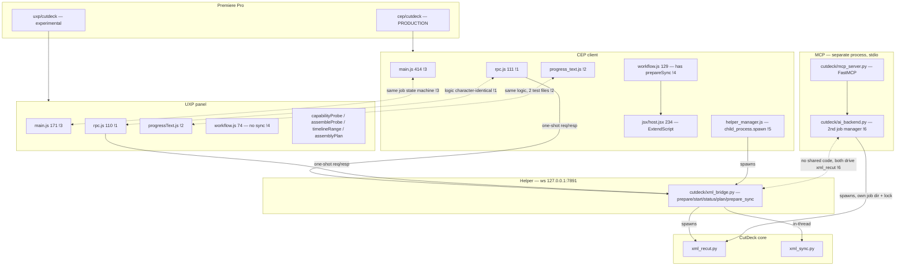
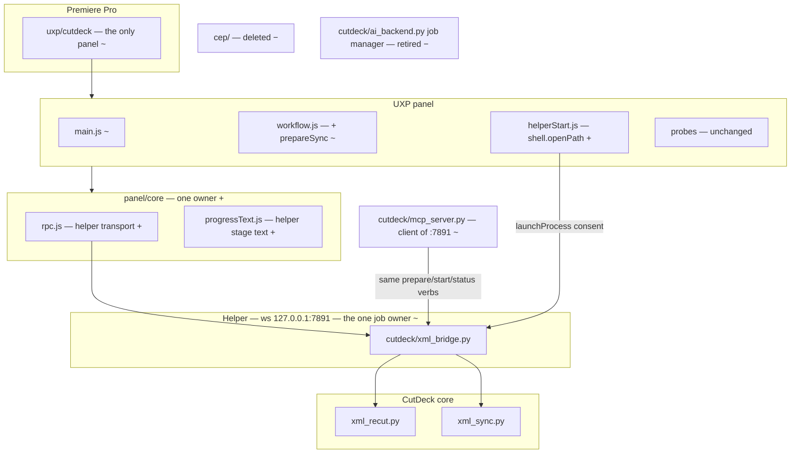

# Architecture & Design: CEP → UXP consolidation, and where MCP attaches

**Topic:** the two Premiere panels (`cep/cutdeck`, `uxp/cutdeck`), the duplication between them, and what to build for MCP.
**Date:** 2026-09-20
**Question read as:** "I want one panel — UXP — with no duplicated code, and I want to know whether to adopt an open-source Premiere MCP server or build my own." Read as an audit of the panel pair plus two decisions; **not** as permission to delete `cep/` today.

---

## Verdict

**Messy in places — and the mess has a measured price: every panel feature is built twice.**

Go fully UXP. Adobe's direction settles it (*traced*: UXP is a standard release in Premiere 2026; CEP 12 is the last major CEP version; Adobe has confirmed retirement with no date). But **UXP cannot ship as a drop-in replacement today** — it is missing a shipped feature (multi-cam sync) and one CEP capability it can never fully match (silent helper auto-start; UXP has no `child_process`, and `shell.openPath` cannot pass arguments, capture output, or run hidden). So this is a sequenced port behind a live-Premiere gate, not a switch.

**The one move that pays the most:** Move 1 — extract `rpc.js` and `progressText` into one shared `panel/core/`. 125 lines with two owners today, and the reason issue #34 shipped three times.

**MCP: build your own — you already have.** `cutdeck/mcp_server.py` runs on the official `mcp` SDK (`mcp>=1.12,<2`, `setup.py:8`). The open-source Premiere MCP servers are the wrong shape for you on three counts, so the real MCP work is not "which server" but **Move 7: stop `mcp_server.py` being a second job manager**.

---

## Change-cost table

The three changes most likely next — from your ask (YC1, YC2) and from what the last month of `git log` actually did (YC3).

| Yardstick change | Modules touched now | After the moves | Evidence for "now" |
|---|---|---|---|
| **YC1** Move fully to UXP, retire CEP | 3 modules, ~10 files (`cep/`, `uxp/`, `cutdeck/`, `tests/`, `scripts/`) | 2 modules, `cep/` deleted | traced across both panel trees |
| **YC2** Give MCP a live-Premiere action | 2 modules, and a **third** job manager appears (`ai_backend` already is the second) | 1 module (`cutdeck/mcp_server.py` as a `:7891` client) | `ai_backend.py` and `xml_bridge.py` share zero code |
| **YC3** Add one panel status/feature (the #34 shape) | 2 modules, 8 files, **3 commits** | 1 module, 3 files | *proven*: `5cb6aa4` (CEP) → `33bc03a` (CEP test) → `c40f612` ("in the UXP panel **too**") |

YC3 is the number that matters. One progress line cost three commits, two source files, and two near-identical test files, because the panel pair has no shared owner.

---

## Concept map — before



**Legend:** `!N` a finding · `+` added · `−` removed · `~` changed · dashed line = coupling with no import between the two ends.

---

## Concept map — after



---

## Findings

| # | Finding | Where | Cost today | Badge | Move |
|---|---|---|---|---|---|
| **!1** | **`rpc.js` exists twice, logic character-identical.** `diff -w` over both bodies, with the one UXP-only comment stripped, is **empty** (*proven*, run this session). Only the `UNREACHABLE` string differs ("Cannot reach CutDeck helper." vs "Cannot reach CutDeck."). Same-reason test: **same owner** — both change when the `:7891` protocol or its retry rule changes. | `cep/cutdeck/client/rpc.js:1-111`, `uxp/cutdeck/rpc.js:1-110` | 110 lines with two owners; only the UXP copy is under test (`tests/cutdeck_rpc.test.cjs:3`) | **Strong** | **1** |
| **!2** | **`progressText` exists twice**, identical logic, divergent copy, and **two near-identical test files**. Feature #34 landed in CEP (`5cb6aa4`), got its test (`33bc03a`), then landed again in UXP two commits later (`c40f612`, "…in the UXP panel **too**"). Same-reason test: same owner — both change when `xml_recut`'s `PROGRESS:` stages change. | `cep/cutdeck/client/progress_text.js`, `uxp/cutdeck/progressText.js`, `tests/cutdeck_cep_progress_text.test.cjs`, `tests/cutdeck_uxp_progress_text.test.cjs` | 1 feature × 3 commits × 2 test files | **Strong** | **1** |
| **!3** | **The job state machine is written twice** — `lastJob` / `save` / `clearJob` / `follow` / `act`, ~90 lines each, with divergent `localStorage` keys (`cutdeck.xml.lastJob` vs `cutdeck.cep.lastJob`, so the two panels cannot recover each other's job). Same-reason test is **mixed**: the polling and job-state rules are one owner; the DOM ids and status styling are not. | `cep/cutdeck/client/main.js:54-193`, `uxp/cutdeck/main.js:18-79` | ~90 duplicated lines; divergent recovery state | **Worth exploring** | **6** (falls out when CEP goes) |
| **!4** | **Multi-cam sync is CEP-only.** `prepareSync` exists in `cep/.../workflow.js:75-93` and nowhere in UXP; `xml_bridge.py:177,214` serves `prepare_sync`/`start_sync` for a client that only CEP has. Shipped in `e8b2216`; UXP never received it. **Going fully UXP today loses a shipped feature.** | `cep/cutdeck/client/workflow.js:75-93`, `cep/.../main.js:270-282`, `uxp/cutdeck/workflow.js` (absent) | the whole multi-cam path | **Strong** | **2** |
| **!5** | **Helper auto-start is CEP-only and UXP cannot reproduce it.** CEP spawns the helper hidden and detached (`helper_manager.js:80-93`). UXP has **no `child_process`** module; the sanctioned route is `shell.openPath`, which *cannot pass arguments, cannot capture output, cannot run hidden*, and needs a `launchProcess` permission plus user consent (*traced*, Adobe recipe). Your `Start CutDeck.cmd` takes no arguments, so `openPath` on it works — with a consent prompt and a visible console window. | `cep/cutdeck/client/helper_manager.js:37-121`; `uxp/cutdeck/manifest.json:11-17` has no `launchProcess` | a real, permanent UX regression on the UXP side unless designed around | **Strong** | **4** |
| **!6** | **Two job managers, no shared code.** `ai_backend.py` (MCP: `output/ai`, own lockfile, states `queued/running/succeeded/failed/interrupted`) and `xml_bridge.py` (panel: `output/premiere`, states `prepared/running/ready/no_cuts/failed`) both spawn `xml_recut` and share **zero** imports. Hidden coupling with no named owner. This is what makes YC2 expensive. | `cutdeck/ai_backend.py:30-181`, `cutdeck/xml_bridge.py:159-320` | two serialization schemes, two GPU serialization locks, two recovery stories for one pipeline | **Strong** | **7** |
| **!7** | **Dead "Full:" label in the CEP panel.** `main.js:102` reads `snap.endSeconds`, but `workflow.capture()` (`workflow.js:39-52`) never returns it — `host.jsx:134` produces `end_seconds` and the mapping drops it. `Math.abs(undefined - x) < 0.1` is always false, so the branch never fires. | `cep/cutdeck/client/main.js:102` | cosmetic; dies with `cep/` anyway | **Speculative** | none — noted, not fixed |

**Contradicts a settled decision.** `docs/arch-design-cutdeck-transcriber.md` § Decisions 3 chose *"Consolidate on CEP + Port 7891 … keep `uxp/` strictly for native assembly research."* Its forces were UXP compositing bugs, cold-start socket denial and the UDT requirement. Two of those are now answered in-repo (`746cc93` fixed cold-start denial with the retry rule; UDT can package a `.ccx` that installs without it — `uxp/spike18_split_probe/README.md:812-841`). The third — Adobe retiring CEP — was not weighed. This document reverses that entry deliberately.

---

## Decisions

| # | Decision | Options | Forces | Door | Evidence |
|---|---|---|---|---|---|
| **D1** | **Go fully UXP, sequenced behind a live gate** | (a) Port sync + install + helper-start into UXP, pass a live Premiere acceptance run, *then* delete `cep/`. (b) Big-bang: delete `cep/` now and fix UXP under fire. | CEP is your working production panel today and every CEP plugin still loads in Premiere 2026; UXP's own README says a live acceptance run is **still pending**. Against that: UXP is the standard release in 2026, CEP 12 is the last major CEP version, retirement is confirmed with no date. Direction is certain, deadline is not — so there is no reason to break a working panel. **Recommend (a).** | Migration: **two-way**. Deleting `cep/` is **one-way for your daily work** → Move 6 does not land without your say-so. | *traced* (Adobe/CEP status, web, this session); *proven* (26 panel tests green) |
| **D2** | **Share only the same-reason panel code during the overlap** | (a) Extract `rpc.js` + `progressText` into `panel/core/`, leave `workflow.js` per-host. (b) Keep both copies until CEP dies — don't invest in code you plan to delete. (c) Build a full shared UI layer. | (b) is tempting and wrong: the overlap is measured in *features*, not days, and #34 already proves each one costs double. (c) fails the same-reason test — `workflow.js` differs because the host API differs (`evalScript` + `host.jsx` vs `ppro`), and merging those drags each host's changes through the other. (a) moves exactly the two modules whose *reason to change* is the helper protocol. **Recommend (a).** | two-way | *proven* (`diff -w` empty); *traced* (both `workflow.js`) |
| **D3** | **UXP helper start: consent-gated `openPath`, with a startup task as the real fix** | (a) `shell.openPath` on `Start CutDeck.cmd` + `launchProcess` permission. (b) Install the helper as a Windows startup/scheduled task so the panel never starts it. (c) Keep it manual (today's UXP behavior). | `openPath` takes no arguments and captures nothing — your `.cmd` needs neither, so (a) works, at the price of a consent dialog and a visible console window. (b) removes the problem instead of working around it and is strictly better for daily use, but it is machine setup, not panel code. **Recommend (a) in the panel as the fallback, (b) as the documented default.** Never (c) alone: it is a regression from what CEP gives you today. | two-way | *traced* (Adobe external-process recipe: no args, no stdout, no exit code, no hidden) |
| **D4** | **MCP: build your own — extend `cutdeck/mcp_server.py`** | (a) Extend your own server (official `mcp` SDK, already in `setup.py:8`). (b) Adopt an open-source Premiere MCP server (`premiere-pro-mcp`, MIT, 276★, 381 tools; `AdobePremiereProMCP`, ~1027 tools; `premiere-pro-full-mcp`). | Three counts against (b): **they are CEP-bridge-first** (`premiere-pro-mcp` drives Premiere through a CEP/ExtendScript file-IPC bridge, with UXP as the optional secondary) — adopting one re-imports the exact dependency D1 is retiring; **none does ASR** — they read Premiere's own transcripts and detect silence with ffmpeg, which is not your Thai `cer_thai`-gated pipeline, your value; and **the dependency bar** — you would use ~6 of 381+ tools, far under 10%, against a server you would have to fork to reach your pipeline. Your own server already exists and is the right size. **Recommend (a).** | two-way (an MCP tool surface you publish to other agents is closer to one-way — keep the tool names stable once used) | *traced* (`mcp_server.py`, `setup.py:8`, the three repos' own docs, this session) |
| **D5** | **Where MCP's jobs live: the `:7891` helper, not a second manager** | (a) `mcp_server.py` becomes a client of `:7891`, reusing `prepare`/`start`/`status`. (b) Keep `ai_backend.py`'s own job dir, lock and state vocabulary. | (b) is !6: two GPU serialization locks means MCP and the panel can each believe they are the only GPU user. (a) gives one job owner, one recovery story, and makes "MCP started this, the panel can resume it" free. **Recommend (a).** | **one-way for the MCP tool contract** if `job_id` shape or `job_states` change — `get_capabilities` publishes `job_states` (`ai_backend.py:86`). Keep the published vocabulary or version it. | *traced* (both files, zero shared imports) |
| **D6** | **Can MCP act on the *live* timeline?** | (a) No — MCP stays file/XML-scoped, as `mcp_server.py`'s instructions already promise ("does not edit live Premiere"). (b) Add a command queue on `:7891` that the panel polls, so an agent can drive the open sequence. | `:7891` is strictly one-shot request/response, always panel-initiated (`rpc.js` closes the socket per exchange; `xml_bridge.serve` only answers). Nothing can push toward the panel today, so (b) is a new protocol direction, new consent questions, and a new failure mode — an agent mutating an edit nobody is watching. **Recommend (a) now.** Revisit only after Move 7, and only with an explicit in-panel approval step. | (b) is **one-way** — confirm before building | *traced* (`xml_bridge.py:361-380`, `rpc.js` `exchange`) |

---

## Context

Every move below assumes: the helper stays on `ws://127.0.0.1:7891` and stays the one server; FCP7 XML stays the transport into Premiere; the `cutdeck/` core (`xml_recut`, `xml_sync`, `xml_audio_extract`) is not restructured here; the Python 3.11.9 venv is unchanged; and **`cep/` keeps working until Move 6, which you authorize separately.** The five moves in `docs/arch-design-cutdeck-transcriber.md` (#31–#35) are orthogonal — nothing here blocks or is blocked by them. A move that contradicts this paragraph is a new decision.

Baseline to hold: `node --test tests/cutdeck_rpc.test.cjs tests/cutdeck_workflow.test.cjs tests/cutdeck_cep_workflow.test.cjs tests/cutdeck_cep_progress_text.test.cjs tests/cutdeck_uxp_progress_text.test.cjs` → **26 pass, 0 fail** (*proven*, this session).

## Moves

### 1. Extract `rpc.js` and `progressText` into one shared `panel/core/`
```
issue:    #36
cost:     110 lines of character-identical transport with two owners, plus one progress
          formatter written twice with two near-identical test files. Issue #34 shipped
          three times (5cb6aa4, 33bc03a, c40f612) for one status line.
pays:     YC3 (one panel status feature): 2 modules / 8 files / 3 commits → 1 module / 3 files.
files:    cep/cutdeck/client/rpc.js:1-111, uxp/cutdeck/rpc.js:1-110,
          cep/cutdeck/client/progress_text.js:1-24, uxp/cutdeck/progressText.js:1-14
owner:    panel/core/rpc.js and panel/core/progressText.js — one copy, CommonJS, plus the
          IIFE window-global shim CEP's index.html needs (keep the shim in the shared file,
          not in a third copy). Settle the two divergent strings once: UNREACHABLE and the
          progress suffix.
callers:  cep/cutdeck/client/main.js:35-36, uxp/cutdeck/main.js:3-4,
          cep/cutdeck/client/index.html (script tags),
          cep/cutdeck/client/helper_manager.js:53, tests/cutdeck_rpc.test.cjs:3,
          tests/cutdeck_cep_progress_text.test.cjs:3, tests/cutdeck_uxp_progress_text.test.cjs:3
door:     two-way, land it and go
proof:    node --test tests/cutdeck_rpc.test.cjs tests/cutdeck_workflow.test.cjs
          tests/cutdeck_cep_workflow.test.cjs tests/cutdeck_*_progress_text.test.cjs
          → still 26 pass, 0 fail; both panels open in Premiere and reach the helper.
          Merge the two progress test files into one against the shared module.
effort:   S
after:    nothing
```

### 2. Port multi-cam sync into the UXP panel
```
issue:    #37
cost:     A shipped CEP feature (e8b2216) with a helper already serving it
          (xml_bridge.py:177 prepare_sync, :214 start_sync) and no UXP client. Retiring CEP
          without this loses the feature.
pays:     YC1 — closes the one functional gap that blocks the UXP panel from being the only panel.
files:    uxp/cutdeck/workflow.js:23-40 (add prepareSync, mirroring cep/.../workflow.js:75-93),
          uxp/cutdeck/main.js:81-89 (a sync control + the job_type === "sync" branch from
          cep/.../main.js:149-162), uxp/cutdeck/index.html
owner:    uxp/cutdeck/workflow.js — the UXP host operations
callers:  uxp/cutdeck/main.js
door:     two-way, land it and go
proof:    extend tests/cutdeck_workflow.test.cjs with the prepareSync cases that
          tests/cutdeck_cep_workflow.test.cjs already covers; node --test green. Then a real
          multi-cam sync from the UXP panel producing the same result sequence as CEP does.
effort:   M
after:    1
```

### 3. Gate: one live Premiere acceptance run of the UXP panel
```
issue:    #38
cost:     uxp/cutdeck/README.md:96-105 lists panel rendering, XML export with In/Out set,
          edge interpretation, import, result discovery and playback sync as never exercised
          by a human. Nothing after this should be trusted until it passes.
pays:     Turns "go fully UXP" from a plan into a decision with evidence — this is the check
          that Move 6 is not allowed to skip or weaken.
files:    none — a gesture, not an edit. Record the result on the issue.
owner:    you (this cannot be automated; no test in this repo can prove it)
callers:  Move 6 does not start until this passes.
door:     two-way (read-mostly; use a test sequence, not a real edit)
proof:    on a short sequence with stacked tracks and two silence gaps: rough cut In–Out,
          multi-cam sync, and one deliberate panel reload mid-job followed by Resume last
          job. Compare the result against the CEP panel's output on the same sequence.
          Success = same cuts, same track alignment, playable audio, source sequence
          untouched, and resume recovers.
effort:   S
after:    2
```

### 4. Give the UXP panel a helper start it can actually perform
```
issue:    #39
cost:     CEP starts the helper silently (helper_manager.js:80-93). UXP has no child_process;
          shell.openPath cannot pass arguments, capture output, or run hidden (traced, Adobe).
          Without this, going UXP is a daily-use regression.
pays:     YC1 — removes the last capability CEP has that UXP lacks.
files:    uxp/cutdeck/manifest.json:11-17 (add launchProcess with extensions [".cmd"]),
          new uxp/cutdeck/helperStart.js (openPath on Start CutDeck.cmd, then poll hello
          via the shared rpc until it answers — reuse helper_manager.js:102-120's poll,
          drop its spawn), uxp/cutdeck/main.js
owner:    uxp/cutdeck/helperStart.js
callers:  uxp/cutdeck/main.js (the cut, sync and resume handlers)
door:     two-way
proof:    node test for the poll-until-hello logic against a fake shell + fake rpc (the shape
          tests/cutdeck_cep_workflow.test.cjs:178 already uses for helper_manager). Then, in
          Premiere with the helper stopped: click Rough Cut, accept the consent prompt, and
          watch the job run. Also document the scheduled-task route (D3b) in the README as
          the recommended default.
effort:   S
after:    3
```

### 5. Package the UXP panel as an installable `.ccx`
```
issue:    #40
cost:     uxp/cutdeck/README.md:15-22 requires Developer Mode plus UXP Developer Tool and a
          manual Load every session. "No UXP Developer Tool required" is CEP's stated headline
          advantage (cep/cutdeck/README.md:8).
pays:     YC1 — removes the last non-functional reason to keep cep/.
files:    uxp/cutdeck/manifest.json (version for release), a packaging note in
          uxp/cutdeck/README.md; retire scripts/install_cutdeck_cep.py with Move 6
owner:    uxp/cutdeck/manifest.json + README
callers:  none in code
door:     two-way
proof:    UDT ⋮ → Package writes cutdeck.ccx (the route already recorded at
          uxp/spike18_split_probe/README.md:812-841); double-click it on this machine with
          Developer Mode OFF, restart Premiere, and find CutDeck under Window > UXP Plugins.
effort:   S
after:    3
```

### 6. Retire `cep/`
```
issue:    #41
cost:     ~1,100 lines of second implementation: CSInterface.js 1291 (vendored), index.html
          547, main.js 414, host.jsx 234, helper_manager.js 145, plus a duplicated workflow
          and its test file. Every panel feature is built twice while it lives.
pays:     YC3 → 1 module / 3 files. YC1 complete. !3 and !7 disappear rather than get fixed.
files:    delete cep/ (whole tree), scripts/install_cutdeck_cep.py,
          tests/cutdeck_cep_workflow.test.cjs, tests/cutdeck_cep_progress_text.test.cjs;
          update CLAUDE.md, SYSTEM_SPEC.md, uxp/cutdeck/README.md ("Role: experimental").
          Leave xml_bridge.py alone — it is host-agnostic.
owner:    uxp/cutdeck — the only panel
callers:  every doc that calls cep/ the production panel
door:     ONE-WAY for daily work — needs your explicit go-ahead, and only after Moves 3, 4
          and 5 pass. Rollback: git revert the deletion commit and re-run
          scripts/install_cutdeck_cep.py. Keep it a single commit that deletes and nothing
          else, so that revert is clean.
proof:    node --test on the remaining cutdeck tests, green; the packaged UXP panel does a
          rough cut and a multi-cam sync on a real sequence with cep/ uninstalled from
          %APPDATA%\Adobe\CEP\extensions.
effort:   S (the risk is all in 3/4/5, not here)
after:    3, 4, 5, and your go-ahead
```

### 7. Make `mcp_server.py` a client of `:7891`, not a second job manager
```
issue:    #42
cost:     Two job managers with zero shared code: ai_backend.py (output/ai, own lockfile,
          states queued/running/succeeded/failed/interrupted) and xml_bridge.py
          (output/premiere, states prepared/running/ready/no_cuts/failed). Both spawn
          xml_recut. Two independent GPU serialization locks for one 8GB GPU — MCP and the
          panel can each believe they are the only user.
pays:     YC2 (a live-Premiere MCP action): 2 modules and a third job manager → 1 module.
          A job an agent starts becomes resumable from the panel for free.
files:    cutdeck/mcp_server.py:30-73 (tools call the helper instead of Backend),
          cutdeck/ai_backend.py:120-181 (submit/status/result/_run retired; keep
          capabilities() and the paging in result()), cutdeck/xml_bridge.py (accept a
          media-path transcribe job, the one verb the helper lacks)
owner:    cutdeck/xml_bridge.py — the one job owner, one lock, one state vocabulary
callers:  cutdeck/mcp_server.py, scripts/start_cutdeck_mcp.py, tests/test_cutdeck_xml_bridge.py
door:     two-way in code; the published tool contract is ONE-WAY once an agent depends on it
          — get_capabilities()["job_states"] (ai_backend.py:86) is a public promise. Either
          keep those five names as the MCP-facing vocabulary and map internally, or version
          the capabilities payload. Do not silently change them.
proof:    python -m pytest tests/test_cutdeck_xml_bridge.py tests/test_cutdeck_bridge.py -q,
          plus a new test that an MCP-started rough cut is visible to a panel `status` call
          with the same job_id. Then: start a rough cut over MCP, and resume it from the
          panel.
effort:   M
after:    nothing (independent of the UXP migration — it is Python-side only)
```

---

## What this run did not read

`transcribe/` (the ASR pipeline), `cutdeck/xml_recut.py`, `xml_sync.py`, `rules.py`, `sequence_mixdown.py` internals, and the eval harness — none is reached by YC1–YC3, and `docs/arch-design-cutdeck-transcriber.md` already covers that ground. `uxp/spike18_split_probe/` was read only for the `.ccx` packaging evidence; it is a spike, out of scope here.

**The observation that would prove this wrong:** if a live acceptance run (Move 3) shows the UXP panel cannot match CEP on export or import fidelity, D1 inverts — the answer becomes "stay on CEP until Adobe forces the move", and Moves 2, 4, 5 and 6 are all wasted. That is exactly why Move 3 sits before Move 6, and why Move 1 (which pays off under either outcome) goes first.
