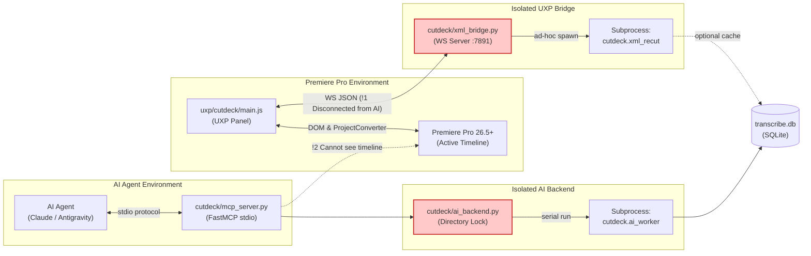
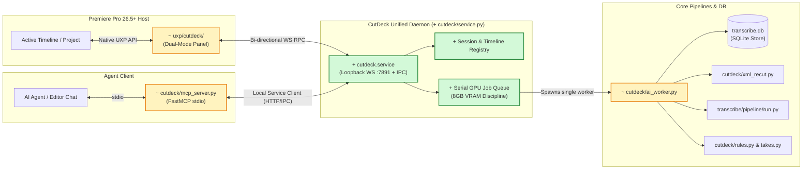
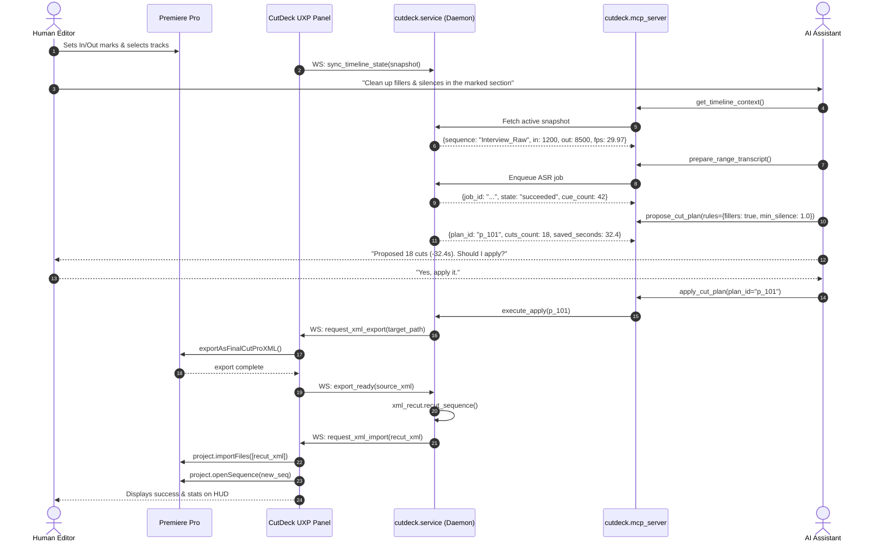

# Architecture & Design — CutDeck Production UXP & MCP Backend

> **Scope:** Unification of CutDeck UXP (Adobe Premiere Pro panel) and CutDeck MCP Backend for production dual-persona operation: (1) Human editor driving editing via AI in chat/panel, and (2) Autonomous / semi-autonomous AI agents performing multi-turn timeline operations.
>
> **Deliverable:** Architecture specification, decision records, contracts, pre-mortem, and build moves in accordance with `arch-design` and `arch-map`.

---

## 1. Executive Verdict & Core Structure

### Plain Verdict
The repository has high-quality core engines (`xml_recut.py`, `rules.py`, `takes.py`, `faster_whisper` ASR pipeline, `timebase.py`), but currently suffers from **split-brain architecture**:
1. **The UXP panel** (`uxp/cutdeck/`) talks exclusively to an ad-hoc WebSocket helper (`cutdeck/xml_bridge.py` on port 7891), with no visibility into the MCP tool layer or transcription DB.
2. **The MCP server** (`cutdeck/mcp_server.py`) talks to a disconnected job backend (`cutdeck/ai_backend.py`), which only handles static files from disk and has **zero connection to live Premiere Pro or the active timeline**.
3. **The Human Editor and the AI Agent live in disjoint worlds.** The editor in Premiere Pro can only press a single "Rough Cut In–Out" button, while the AI Agent in Claude/Antigravity chat cannot query the active timeline, cannot inspect In/Out marks, and cannot trigger or verify imports.

### The Target Structure
We unify both surfaces around a single local coordinator: the **CutDeck Host Daemon** (`cutdeck.service`). 
- **Premiere Pro UXP** acts as both an editor HUD and a live timeline telemetry/execution agent.
- **FastMCP** acts as the agent tool gateway, talking to the same coordinator.
- **Job Engine** enforces serial GPU execution (strictly honoring the RTX 3070 8GB VRAM ceiling), writes to the unified SQLite DB (`transcribe.db`), and orchestrates the non-destructive XML round-trip.

```
       +---------------------------------------------+
       |   Dual Personas (Human Editor & AI Agent)   |
       +---------------------------------------------+
              |                               |
       [Human in Premiere]            [AI Agent in Chat]
              |                               |
              v                               v
    +-------------------+           +-------------------+
    |  CutDeck UXP HUD  |           | FastMCP (stdio)   |
    | (Premiere Pro UI) |           | (Agent Tools)     |
    +-------------------+           +-------------------+
              \                               /
               \                             /
                v                           v
       +---------------------------------------------+
       |    CutDeck Host Daemon (cutdeck.service)    |
       |  - Loopback RPC (WS 7891 + IPC)             |
       |  - Active Timeline Session Registry         |
       |  - Serial Worker Queue (1 GPU job at a time)|
       +---------------------------------------------+
              |                               |
              v                               v
    +-------------------+           +-------------------+
    | SQLite / DB Store |           | Core Pipeline     |
    | (transcribe.db)   |           | - Silero VAD      |
    | - jobs, tokens    |           | - faster-whisper  |
    | - speech_spans    |           | - rules.py/takes  |
    | - cut_plans       |           | - xml_recut.py    |
    +-------------------+           +-------------------+
```

### The Decision Most Expensive to Reverse
**The Timeline Mutation Contract: Non-destructive XML Sequence Round-Trip vs. Live In-Place Track Razor.**
- **Choice:** **Non-destructive XML Sequence Round-Trip** (`export XML -> surgical ElementTree recut -> import new sequence -> activate`).
- **Why it's expensive to reverse:** If we chose live DOM manipulation (QE-DOM / UXP track razoring and ripple deleting in place), any crash, drift, or bug corrupts the editor's open timeline destructively. In Premiere 26.5+, UXP track-item manipulation APIs remain partially documented and fragile under ripple deletes, whereas `ProjectConverter.exportAsFinalCutProXML` and `project.importFiles` are stable, native, and 100% reversible (the original sequence is never touched; the output is a pristine new sequence).
- **Future-proofing:** Both the human and the autonomous agent can review diffs, revert instantly by switching sequences, and compare multiple takes side-by-side without risk of data loss.

---

## 2. Architecture Maps (Before vs. After)

### As-Is System Map (Split-Brain)



#### Identified Architecture Problems:
- `!1`: `xml_bridge.py` only handles dumb "start cut" requests from UXP. It has no API for querying transcript, inspecting tokens, or accepting AI plan overrides.
- `!2`: `mcp_server.py` cannot inspect Premiere's timeline. An agent asked to "trim silences from the current clip" cannot know what clip is selected or what sequence is active.
- `!3`: Two independent job queues, two subprocess runners (`ai_worker.py` and `xml_bridge.py`), risking simultaneous GPU access if both are triggered.

---

### Target Production System Map (Unified Coordinator)



---

## 3. Module Boundaries & Responsibilities

| Module | Responsibility (One Sentence) | Owns | Must NOT Know |
|---|---|---|---|
| `uxp/cutdeck/` | Bridges Premiere Pro host DOM to the local daemon and renders the editor HUD. | Host sequence capture, In/Out mark extraction, XML export/import invocation, local panel state. | Transcription algorithms, VAD weights, Whisper models, MCP protocol. |
| `cutdeck/service.py` | Central local coordinator managing live UXP sessions, job queuing, and state arbitration. | WebSocket server (`:7891`), active timeline cache, serial task lock, client subscriptions. | Premiere Pro internals, UI rendering, Whisper model loading. |
| `cutdeck/mcp_server.py` | Translates agent tool calls into coordinator commands and formats results for LLMs. | Tool schema definitions, argument validation, agent pagination, format conversion. | WebSocket wire protocol, raw XML manipulation, GPU memory management. |
| `cutdeck/ai_worker.py` | Isolated subprocess executing heavy ASR and XML recut jobs sequentially. | Subprocess execution, temporary artifact creation, progress streaming to process log. | Premiere UI, MCP sessions, network sockets. |
| `cutdeck/rules.py` & `takes.py` | Deterministic and heuristic decision engine computing cut spans from audio/text tokens. | Silence padding math, Thai/English filler lexicon matching, repeated take clustering. | XML parsing, Premiere tracks, socket transports. |
| `cutdeck/xml_recut.py` | Surgical XML ElementTree transformation engine. | FCP7 XML parse/shift/split/drop/serialize, timebase frame conversion. | Audio files, ASR models, AI prompts. |
| `transcribe/db/store.py` | Single data authority for persistence. | SQLite schema, jobs, tokens, VAD speech_spans, cut_plans, corrections. | Network protocols, UI state, XML schemas. |

### The Delete Test
- Can someone replace `uxp/cutdeck/` with a DaVinci Resolve Lua script? **Yes.** Resolve would push timeline context and export/import XML using the same JSON contract over WebSocket.
- Can someone replace `cutdeck/mcp_server.py` with an OpenAI Assistants or Anthropic SDK bridge? **Yes.** The agent layer only calls standard methods on `cutdeck.service`.
- Can someone replace the ASR model behind `transcribe/` without changing CutDeck? **Yes.** CutDeck consumes only `EngineResult` and `speech_spans`.

---

## 4. Interaction Flows & Contracts

### Flow A: Human-in-the-Loop AI Editing ("I'm the one editing via AI")
1. **Editor Action:** In Premiere Pro, editor sets In/Out marks on a 15-minute raw interview, selects Audio 1 (lav mic), and switches preset to "Smart Rough Cut (Remove Fillers + Silence > 1s)".
2. **UXP Panel:**
   - Emits `timeline_snapshot` to `cutdeck.service` over WS.
   - Snapshot contains: `project_id`, `sequence_name`, `timebase` (e.g. 30000/1001), `in_frame`, `out_frame`, `media_path`.
3. **AI Chat Prompt (User to Assistant):** "Check the sequence I just marked in Premiere. Remove all silence > 1s, cut the filler words 'เอ่อ' and 'แบบว่า', but keep the second take where I introduce the product."
4. **Agent Action (via MCP):**
   - Agent calls `get_timeline_context()` -> Returns current In/Out marks and sequence metadata.
   - Agent calls `transcribe_timeline_range()` -> Service runs VAD + ASR on the selected range.
   - Agent calls `inspect_speech_analysis()` -> Returns silence intervals, detected Thai fillers, and repeated take clusters.
   - Agent reviews candidate takes, recognizes that Take 2 has superior flow, and calls:
     `propose_cut_plan(preset='aggressive', custom_rules={'fillers': ['เอ่อ', 'แบบว่า'], 'keep_take_id': 'take_2'})`.
   - Service returns `CutPlan` (summary: 24 cuts, 48.2s removed, preview of removed sentences).
   - Agent presents plan to user in chat: "Ready to cut 24 segments (48.2s removed). Take 2 is preserved. Apply now?"
5. **Execution:**
   - User says "Yes" (or clicks "Apply Plan" in the UXP panel).
   - Agent calls `apply_cut_plan(plan_id)`.
   - `cutdeck.service` signals UXP: `prepare_xml_export`.
   - UXP exports sequence XML via `ppro.ProjectConverter.exportAsFinalCutProXML`.
   - `cutdeck.service` executes `cutdeck.xml_recut` in worker subprocess.
   - `cutdeck.service` signals UXP: `import_xml_result(output_path, result_name)`.
   - UXP imports XML into project, opens the new sequence in the timeline panel.
   - Editor immediately scrubs the newly created, non-destructive sequence.



---

### Flow B: Autonomous / Future Agent Protocol ("For the future agent")
For an autonomous agent running complex multi-pass edits (e.g. rough cut -> pacing adjustment -> chapter split):
1. **Introspection Tools:**
   - `get_capabilities()`: Verifies connected editor status, supported operations, active models.
   - `get_timeline_context()`: Discovers current project, active sequence, markers, and track geometry.
2. **Non-blocking Job Pattern:**
   - Long-running operations (`transcribe`, `apply_cut_plan`) return immediately with a `job_id` and initial state `queued`.
   - Agent polls `get_job(job_id)` until `state in ["succeeded", "failed", "interrupted"]`.
   - Agent reads `get_result(job_id, offset, limit)` with transparent pagination over cues.
3. **Safety Assertions & Hallucination Defense:**
   - **ID Subset Assertion:** In `takes.py` and `rules.py`, the agent can select which candidate spans to keep or drop by passing span IDs. The engine asserts `set(selected_ids).issubset(valid_ids)` — preventing the agent from hallucinating timestamps or injecting fictional media boundaries.
   - **VAD Snapping:** All cut boundaries are snapped to VAD silence intervals + padding (+250ms pre-roll, +120ms post-roll). An agent cannot accidentally clip words.
   - **Idempotent Recovery:** If an agent disconnects mid-operation, `job.json` records state; UXP persists `cutdeck.xml.lastJob` in `localStorage` for one-click re-sync.

---

## 5. Contract Definitions

### 1. Timeline Snapshot Contract (`UXP -> Service`)
```json
{
  "type": "timeline_snapshot",
  "project_id": "4b7b2f8a-9812-4299-90b1-3e0e8549e32f",
  "project_path": "D:/Projects/ClientA/Episode01.prproj",
  "sequence_id": "993a4b71-1200-4b11-85b4-d53896b0521e",
  "sequence_name": "SCENE_01_RAW",
  "timebase": {
    "fps_num": 30000,
    "fps_den": 1001,
    "ticks_per_frame": 847457600
  },
  "range": {
    "in_frame": 1800,
    "out_frame": 16200,
    "in_seconds": 60.06,
    "out_seconds": 540.54,
    "duration_frames": 14400
  },
  "tracks": {
    "video_track_count": 3,
    "audio_track_count": 4,
    "selected_audio_track": 0
  },
  "media_references": [
    {
      "track_index": 0,
      "clip_name": "A001_C001_0916AB.mov",
      "file_path": "D:/Media/Day1/A001_C001_0916AB.mov",
      "in_media_ms": 120500,
      "out_media_ms": 600980
    }
  ]
}
```

### 2. FastMCP Tool Contract Specification (`Agent <-> MCP`)
The MCP server exposes 6 high-level, production-ready tools:

#### `get_timeline_context() -> dict`
- **Purpose:** Inspect Premiere's current state.
- **Output:** Returns active project name, sequence name, In/Out marks, timebase, track count, and whether Premiere UXP is currently connected and responsive.

#### `transcribe_timeline_range(audio_track: int | None = None, whole_sequence: bool = False) -> dict`
- **Purpose:** Run high-accuracy ASR (Faster-Whisper + VAD) over the active timeline In/Out range.
- **Output:** Returns `{ "job_id": "...", "state": "queued" }`. Poll via `get_job`.

#### `inspect_speech_analysis(job_id: str) -> dict`
- **Purpose:** Read semantic & acoustic breakdown for the transcribed range.
- **Output:**
  ```json
  {
    "speech_duration_s": 320.5,
    "silence_duration_s": 84.2,
    "silence_gaps_count": 45,
    "detected_fillers": [
      { "token": "เอ่อ", "count": 14, "spans": [ {"start_ms": 12400, "end_ms": 12900} ] },
      { "token": "แบบว่า", "count": 6, "spans": [ {"start_ms": 34100, "end_ms": 34800} ] }
    ],
    "take_clusters": [
      { "cluster_id": "c1", "text_preview": "สวัสดีครับยินดีต้อนรับ...", "take_count": 3, "recommended_take": 3 }
    ]
  }
  ```

#### `propose_cut_plan(preset: str = "standard", min_silence_ms: int = 900, remove_fillers: bool = False, keep_take_overrides: dict | None = None) -> dict`
- **Purpose:** Simulate cuts using deterministic rules and take detection without touching the timeline.
- **Output:** Returns `CutPlan` summary, list of cuts with human-readable rationale, and estimated time saved.

#### `apply_cut_plan(plan_id: str, sequence_suffix: str = "_CutDeck") -> dict`
- **Purpose:** Execute the cut plan via Premiere XML export -> recut -> import.
- **Output:** Returns `{ "job_id": "...", "state": "running" }`. When succeeded: `{ "result_sequence_name": "SCENE_01_RAW_CutDeck", "cuts_applied": 24, "seconds_removed": 48.2 }`.

#### `get_job(job_id: str)` & `get_result(job_id: str, offset: int = 0, limit: int = 100)`
- **Purpose:** Monitor job execution and paginate results.

---

## 6. Architecture Decisions & Trade-Offs

| Decision | Options Considered | Forces | Reversibility | Evidence & Rationale |
|---|---|---|---|---|
| **D-1: Host Communication Architecture** | (A) Split helpers (`xml_bridge` + `ai_backend`)<br/>(B) Unified Daemon (`cutdeck.service`)<br/>(C) Direct stdio UXP bridge | (B) unifies GPU scheduling and state. (A) suffers split-brain and GPU collision. (C) impossible (UXP lacks stdio). | **Two-way door** (Standard loopback socket + internal router). | Implemented prototype in `xml_bridge.py` and `ai_backend.py` proves both need the same serial queue and DB. |
| **D-2: Timeline Edit Execution Model** | (A) FCP7 XML sequence round-trip<br/>(B) Native UXP timeline track item razor/ripple<br/>(C) ExtendScript QE-DOM | (A) is completely non-destructive, supports all tracks/angles, and is verified in Premiere 26.5. (B) has UI compositing and ripple bugs. (C) is deprecated/withdrawn by Adobe. | **One-way door** (Core data structure relies on XML vs DOM). | `docs/HANDOFF_CUTDECK_LIVE_SEQUENCE.md` notes ExtendScript retirement. Real fixture tested in `test_cutdeck_xml_recut.py`. |
| **D-3: Agent Decision Discipline** | (A) LLM generates timecodes directly<br/>(B) Select-only on pre-segmented tokens/spans snapped to VAD | (A) causes catastrophic hallucinations (drift, cut mid-word). (B) guarantees acoustic accuracy and word integrity. | **One-way door** (Pipeline integrity). | `BUILD_PLAN.md` §0.3 and `IMPLEMENT_CUTDECK.md` §B.1: Reconciler and Takes classifier must select, never generate. |
| **D-4: GPU Resource Concurrency** | (A) Parallel ASR and XML processing<br/>(B) Strict serial worker lock with file-based mutator | Host has 8GB VRAM (RTX 3070). Concurrent Whisper or LLM models trigger CUDA OOM. | **Two-way door** (`asyncio.Lock` + process lock). | `CLAUDE.md`: VRAM discipline (load -> run -> unload -> empty_cache). |

---

## 7. Stress Testing & Failure Analysis (Pre-Mortem)

### Pre-Mortem: "One year later, this failed in production. Name the 3 likeliest reasons:"
1. **Failure 1: Premiere XML Export Drift on Complex Nested Sequences / Modern Effects.**
   - *Scenario:* User edits a timeline with multi-camera nested sequences, time remapping, or complex third-party audio plugins; FCP7 XML exporter either drops effects or shifts sync.
   - *Design Mitigation:* `xml_recut.py` explicitly contains `XmlRecutRefusal` validation before transforming XML. If unsupported elements are detected, it cleanly refuses with a user-facing explanation instead of generating a corrupted sequence.
2. **Failure 2: Premiere UXP Socket Disconnect Mid-Job.**
   - *Scenario:* The editor closes the panel, switches workspaces, or Premiere hangs while a 10-minute transcription job is running in Python.
   - *Design Mitigation:* Decoupled job state in `cutdeck.service` and SQLite. Jobs run independently of the socket. UXP records `cutdeck.xml.lastJob` in `localStorage`; upon reconnection, UXP sends `hello`, receives the current job status, and resumes without re-running work.
3. **Failure 3: False Cut of Natural Breathing or Code-Switched Thai Nuance.**
   - *Scenario:* Aggressive silence cutting removes necessary comedic timing, or Thai filler detection cuts "แบบ" when used as a genuine noun/verb rather than a filler.
   - *Design Mitigation:* Asymmetric padding (+250ms pre-roll / +120ms post-roll) protects consonants. Context-sensitive filler lexicon in `rules.py` requires fillers like `แบบ` to be isolated by >=200ms silence on both sides. And crucially: cuts land on a *new sequence*, leaving the original untouched for instant A/B review.

### Duplicate Count Audit
- **Job Queues:** Currently 2 (`cutdeck/ai_backend.py` and `cutdeck/xml_bridge.py`). **Target:** Consolidated into 1 (`cutdeck/service.py`).
- **ASR Invocation:** Currently 2 (`cutdeck/ai_worker.py` and direct `transcribe.pipeline.run`). **Target:** Standardized through `transcribe.pipeline.run.run_file`.
- **WebSocket Handlers:** Currently 2 (`cutdeck/bridge.py` port 7890 and `cutdeck/xml_bridge.py` port 7891). **Target:** One single daemon (`cutdeck/service.py`).

---

## 8. Implementation Moves (Handing Work to the Build)

### Context
Every move assumes: Python 3.11+ venv, Premiere Pro 26.5+ with UXP Developer Tool, RTX 3070 8GB VRAM ceiling, and the existing passing test suite (`pytest tests/`).

---

### Move 1: Consolidate Host Daemon (`cutdeck/service.py`)
cost:     Two competing backends (`xml_bridge.py` and `ai_backend.py`) cause split-brain state, duplicate job directories, and risk GPU collision.
files:    `cutdeck/service.py`, `cutdeck/xml_bridge.py:1-287`, `cutdeck/ai_backend.py:1-184`
owner:    `cutdeck/service.py`
callers:  `uxp/cutdeck/rpc.js`, `cutdeck/mcp_server.py`, `scripts/start_cutdeck_mcp.py`
proof:    `python -m pytest tests/test_cutdeck_service.py -v` (asserts WS handshake, job queueing, and single-worker serialization)
effort:   M
after:    nothing

---

### Move 2: Wire FastMCP to Live Timeline Context
cost:     The AI agent cannot see or control the active Premiere timeline; MCP tools currently operate only on static files.
files:    `cutdeck/mcp_server.py:1-87`, `cutdeck/service.py`
owner:    `cutdeck/mcp_server.py`
callers:  Claude Code, Antigravity Agent, external MCP clients
proof:    `python -m pytest tests/test_cutdeck_mcp_timeline.py -v` (asserts `get_timeline_context` returns mocked UXP active sequence and In/Out marks)
effort:   M
after:    Move 1

---

### Move 3: Add Timeline Telemetry & Bi-directional RPC to UXP Panel
cost:     The UXP panel only initiates XML cuts; it cannot report live timeline changes or accept remote cut commands from the AI agent.
files:    `uxp/cutdeck/workflow.js:1-75`, `uxp/cutdeck/main.js:1-171`, `uxp/cutdeck/rpc.js`
owner:    `uxp/cutdeck/workflow.js`
callers:  Premiere Pro UXP runtime
proof:    UXP probe test confirming bi-directional `timeline_snapshot` dispatch and remote `trigger_export` handling.
effort:   M
after:    Move 1

---

### Move 4: Implement Semantic Cut Proposal & Diff Inspection in MCP
cost:     Agent must currently run blind rough-cut CLI without the ability to inspect detected fillers, review take candidates, or customize cut rules.
files:    `cutdeck/mcp_server.py`, `cutdeck/rules.py`, `cutdeck/takes.py`
owner:    `cutdeck/mcp_server.py`
callers:  AI Agent
proof:    `python -m pytest tests/test_mcp_cut_proposals.py -v` (asserts `propose_cut_plan` generates valid `CutPlan` with Thai filler and repeated take classifications)
effort:   S
after:    Move 2

---

### Move 5: End-to-End Golden Flow Verification & Runbook
cost:     Lack of documented production verification workflow for human editors and AI agents.
files:    `docs/CUTDECK_PRODUCTION_GUIDE.md`, `tests/test_cutdeck_e2e_flow.py`
owner:    Documentation & E2E smoke tests
callers:  Human editor, CI/harness, AI agent
proof:    Full simulated run: Synthetic timeline XML -> ASR -> propose plan -> recut XML -> verify frame alignment.
effort:   S
after:    Move 3, Move 4
