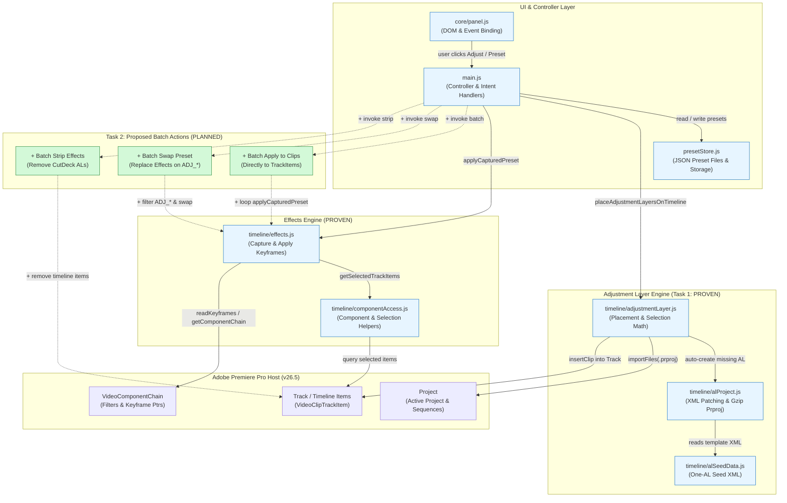

# CutDeck Adj & FX: Architecture Map (Task 1 Complete, Task 2 Proposed)

CutDeck's Adjustment Layer & Quick-Effects system automatically generates, imports, and places resolution-accurate Adjustment Layers onto the Premiere timeline, capturing and replaying keyframed effect stacks across clips.

Traced on 2026-09-23 against `feat/cutdeck-transform-align` based on [HANDOFF_CUTDECK_AL_FX_NEXT.md](file:///d:/01%20-%20Antigravity/00%20Claude/B-transcriber/docs/HANDOFF_CUTDECK_AL_FX_NEXT.md). It is true on the day it was traced.

*Evidence labels: **proven** = ran in Premiere/tests · **traced** = read the whole chain · **suspected** = neither.*

---

## Architecture Map

---

## Legend

| Mark | Meaning | Description |
|---|---|---|
| `proven` | Implemented & Verified | Confirmed working in Premiere Pro 26.5 and verified by node tests |
| `+` | Added / Planned (Task 2) | Proposed batch actions described in handoff (Apply to clips, Swap, Strip) |
| `~` | Modified / Coordinated | Controller or wiring adapted to support new batch flows |

---

## Evidence Table

| Arrow / Link | Type | Source & Target | File : Line Reference | Note |
|---|---|---|---|---|
| `panel -> main` | traced | `core/panel.js` → `main.js` | [main.js:480-486](file:///d:/01%20-%20Antigravity/00%20Claude/B-transcriber/uxp/cutdeck/main.js#L480-L486) | Binds UI intents (`onAdjust`, `onApplyPreset`, `onProbe`) |
| `main -> store` | traced | `main.js` → `presetStore.js` | [main.js:434](file:///d:/01%20-%20Antigravity/00%20Claude/B-transcriber/uxp/cutdeck/main.js#L434) | `presetStore.add(preset)` persists preset JSON file |
| `main -> adj` | traced | `main.js` → `adjustmentLayer.js` | [main.js:230](file:///d:/01%20-%20Antigravity/00%20Claude/B-transcriber/uxp/cutdeck/main.js#L230), [main.js:267](file:///d:/01%20-%20Antigravity/00%20Claude/B-transcriber/uxp/cutdeck/main.js#L267) | Calls `placeAdjustmentLayersOnTimeline` |
| `main -> fx` | traced | `main.js` → `effects.js` | [main.js:281](file:///d:/01%20-%20Antigravity/00%20Claude/B-transcriber/uxp/cutdeck/main.js#L281), [main.js:430](file:///d:/01%20-%20Antigravity/00%20Claude/B-transcriber/uxp/cutdeck/main.js#L430) | Calls `applyCapturedPreset` and `captureEffectFromTrackItem` |
| `adj -> alProj` | proven | `adjustmentLayer.js` → `alProject.js` | [adjustmentLayer.js:295-302](file:///d:/01%20-%20Antigravity/00%20Claude/B-transcriber/uxp/cutdeck/timeline/adjustmentLayer.js#L295-L302) | Dynamically generates `.prproj` bytes when no AL matches |
| `alProj -> seed` | proven | `alProject.js` → `alSeedData.js` | [alProject.js:13](file:///d:/01%20-%20Antigravity/00%20Claude/B-transcriber/uxp/cutdeck/timeline/alProject.js#L13) | Patches seed XML FrameRect & ObjectUIDs |
| `adj -> pproProj` | proven | `adjustmentLayer.js` → Premiere Host | [adjustmentLayer.js:305](file:///d:/01%20-%20Antigravity/00%20Claude/B-transcriber/uxp/cutdeck/timeline/adjustmentLayer.js#L305) | `project.importFiles([filePath], true, adjBin, false)` |
| `adj -> pproTimeline` | proven | `adjustmentLayer.js` → Premiere Host | [adjustmentLayer.js:1010-1065](file:///d:/01%20-%20Antigravity/00%20Claude/B-transcriber/uxp/cutdeck/timeline/adjustmentLayer.js#L1010-L1065) | `track.insertClip(alItem, startTickTime)` |
| `fx -> comp` | traced | `effects.js` → `componentAccess.js` | [effects.js:37-44](file:///d:/01%20-%20Antigravity/00%20Claude/B-transcriber/uxp/cutdeck/timeline/effects.js#L37-L44) | Imports `getSelectedTrackItems`, `runInTransaction`, etc. |
| `fx -> pproChain` | proven | `effects.js` → Premiere Host | [effects.js:72-85](file:///d:/01%20-%20Antigravity/00%20Claude/B-transcriber/uxp/cutdeck/timeline/effects.js#L72-L85), [effects.js:240-270](file:///d:/01%20-%20Antigravity/00%20Claude/B-transcriber/uxp/cutdeck/timeline/effects.js#L240-L270) | Mutates `VideoComponentChain` & Keyframe offsets |
| `main -> batchApply` | suspected | `main.js` → Batch Apply | [HANDOFF_CUTDECK_AL_FX_NEXT.md:82](file:///d:/01%20-%20Antigravity/00%20Claude/B-transcriber/docs/HANDOFF_CUTDECK_AL_FX_NEXT.md#L82) | Proposed: loop `applyCapturedPreset` over selection |
| `main -> batchSwap` | suspected | `main.js` → Batch Swap | [HANDOFF_CUTDECK_AL_FX_NEXT.md:85](file:///d:/01%20-%20Antigravity/00%20Claude/B-transcriber/docs/HANDOFF_CUTDECK_AL_FX_NEXT.md#L85) | Proposed: scan `ADJ_*`, clear matchNames, apply new |
| `main -> batchStrip` | suspected | `main.js` → Batch Strip | [HANDOFF_CUTDECK_AL_FX_NEXT.md:88](file:///d:/01%20-%20Antigravity/00%20Claude/B-transcriber/docs/HANDOFF_CUTDECK_AL_FX_NEXT.md#L88) | Proposed: identify `ADJ_*` in range & remove in single undo |
